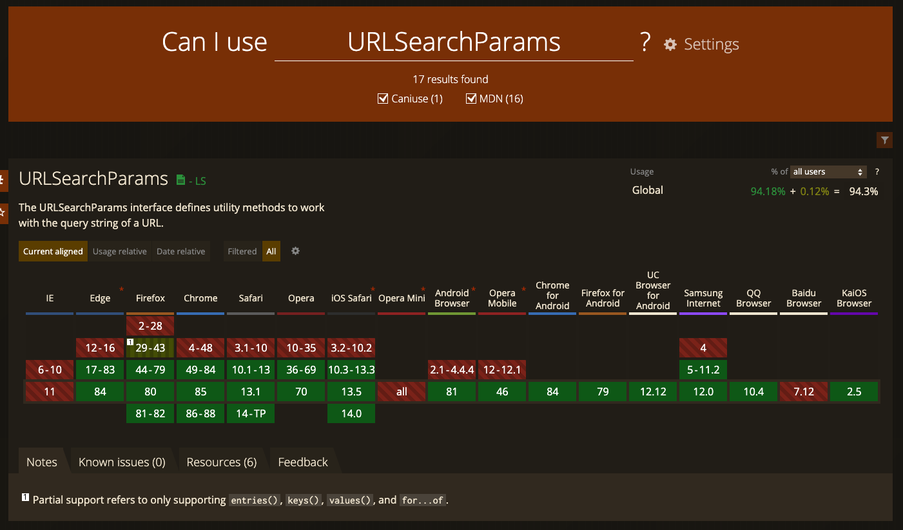

window.location.search를 읽어, 사용하기 좋은 ~~object~~ 형태로 만들어야 한다.

이를 구현할 수 있는 여러 라이브러리(~~react-router~~, ~~react-router-dom~~, ~~use-react-router~~, ...)가 있지만, 모두 Provider를 필요로 한다.

가볍게 아무데서나 호출할 수 있는 custom hook을 만들어보자!

## 구현

```tsx
import { useEffect, useState } from 'react';

export const useQueryParams = (): { [name: string]: string } => {
  const [params, setParams] = useState({});

  useEffect(() => {
    const temp = {};
    new URLSearchParams(window.location.search).forEach((value, key) => {
      temp[key] = value;
    });
    setParams(temp);
  }, []);

  return params;
};
```

<center>hooks/route.ts</center>

[URLSearchParams](https://developer.mozilla.org/en-US/docs/Web/API/URLSearchParams) 객체를 사용해 간단하게 구현했다.

## 적용

```tsx
...
import { useQueryParams } from 'hooks/route';

export default function PostsPage({ data, location }: PageProps<any>) {
  const { tag } = useQueryParams();

  return (
    <Wrapper>
      <PageTitle>{tag ? `Tag - ${tag}` : 'Posts'}</PageTitle>
      ...
    </Wrapper>
  );
}
```

<center>pages/posts.tsx</center>

성공적으로 작동한다!

## 이슈1 : 초기렌더링


`ssr` 또는 `static generate` 환경에서 페이지에 처음 접근하거나 새로고침했을 때, 기본 값인 Posts가 노출되는 것을 확인할 수 있다!

이는 갯츠비의 ~~static rendering~~ 시점에 useEffect가 실행되지 않았고, 그로 인해 tag 변수에 `undefined` 값이 들어갔기 때문이다.

따라서 아래와 같이 사용할 경우 에러가 난다 😥

```tsx
...
import { useQueryParams } from 'hooks/route';

export default function Hello() {
  const { tag } = useQueryParams();

  return (
    <Text>태그의 길이는 {tag.length}</Text>
  ); // TypeError: Cannot read property 'length' of undefined

  return (
    <Text>태그의 길이는 {tag?.length}</Text>
  ); // OK
}
```

<br>

이처럼 client-side에서만 존재하는 값을 다룰 때는 [optional chaining](https://developer.mozilla.org/ko/docs/Web/JavaScript/Reference/Operators/Optional_chaining)이나 [별도의 state를 사용하여](https://github.com/greatSumini/greatSumini.github.io/blob/source/src/pages/posts.tsx) ~~undefined~~를 대응할 필요가 있다.

## 이슈2 : 구형 브라우저 대응



<br>

[can i use](https://caniuse.com/?search=window)에 검색해보면 IE를 포함한 대부분의 구버전 브라우저에서 URLSearchParams를 지원하지 않는다! 전세계 94.3%가 정상적으로 사용가능하지만, 서비스 특성상 IE를 지원해야한다면 어쩔 수 없이 ~~polyfill~~을 준비해야만 한다.

<br>

```typescript
import { useEffect, useState } from 'react';

export const useQueryParams = (): { [name: string]: string } => {
  const [params, setParams] = useState({});

  useEffect(() => {
    const temp = {};
    window.location.search.replace(/[?&]+([^=&]+)=([^&]*)/gi, ((
      _str,
      key,
      value
    ) => {
      temp[key] = value;
    }) as () => string);
    setParams(temp);
  }, []);

  return params;
};
```

<center>hooks/route-polyfill.ts</center>

[String.prototype.replace()](https://developer.mozilla.org/ko/docs/Web/JavaScript/Reference/Global_Objects/String/replace)를 이용해 정상적으로 구현했다!

<br>

## Links

- [hooks/route.ts](https://github.com/greatSumini/greatSumini.github.io/blob/source/src/hooks/route.ts)
- Click this link to see use case in actual application
  : [pages/posts.tsx](https://github.com/greatSumini/greatSumini.github.io/blob/source/src/pages/posts.tsx)
