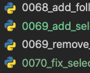
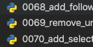

feature 브랜치에서 작업하던중 develop 브랜치에 새로운 변경 사항들이 생겼다.

확인해보니 두 브랜치에서 같은 app내의 모델을 수정해, 넘버링이 겹치는 문제가 생겼다. 😅

remote 브랜치의 migrations를 보존하면서 local 브랜치의 migration들을 정리해보자!

## 1. migration conflict 해결

```shell
$ git pull origin <remote_branch_name>
```



위 사진과 같이 69번 migration이 중복으로 생성된 것을 확인할 수 있다!<br>
roll back 후 다시 migration을 생성해 해결해보자

<br>

```shell
# conflicted migration files 삭제
$ rm 0069_add_selects_request.py
$ rm 0070_fix_selects_request_sns_link,content.py
```

local 브랜치에서 작업한 migration 파일들을 모두 삭제한다.

<br>

```shell
# migration 롤백 후 remote 적용
$ ./manage.py migrate items 0068_add_follwers_count.py
$ ./manage.py migrate
```

base 상태로 되돌아간 후 `migrate` 명령어를 실행해 remove 브랜치의 migration을 적용한다.

<br>

```shell
# migration 재생성
$ ./manage.py makemigrations items
```

local 브랜치의 변경을 반영하기 위한 migration 파일을 새로 생성한다! 이후 파일명을 적절하게 바꿔준다.

<br>



깔끔하게 반영됐다 ㅎ

## 2. DB conflict 해결

migrate 후에 테스트를 돌려보니 <span style="color:red">django.db.utils.ProgrammingError: relation already exists</span> 에러가 발생했다!

이유는 rollback전에 생성한 local migration에서 이미 새로운 모델의 relation을 생성했는데, rollback하고 다시 생성하는 과정에서 relation이 삭제되지 않고 남아있던 것이다.

이를 해결하기위한 여러가지 방법이 있지만, 실수 가능성 없이 깔끔하게 해결하기 위해 DB를 초기화 해보겠다.

```shell
# postgresql cli 접속
$ psql

# 데이터베이스 drop후 재생성
postgres=# drop database <local_db_name>;
postgres_test=# create database <local_db_name> encoding 'utf-8';
postgres_test=# grant all privileges on database <local_db_name> to <local_user_name>;

# production db dump
$ pg_dump -U <user_name> -h <host> -p <port_number> -d <db_name> > production.sql
$ psql <local_db_name> -U <local_user_name> < production.sql
```

1. local db를 drop후 재생성한다.
2. 서비스중인 production db를 dump해서 가져온다.
3. dump한 파일 내용을 local db에 적용한다.

다시 테스트를 실행하면 잘 돌아간다 ✨
