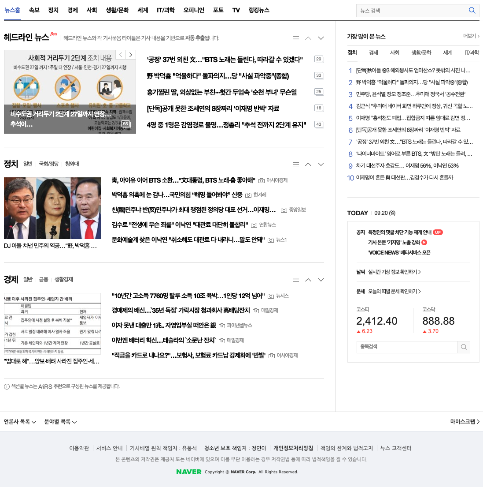
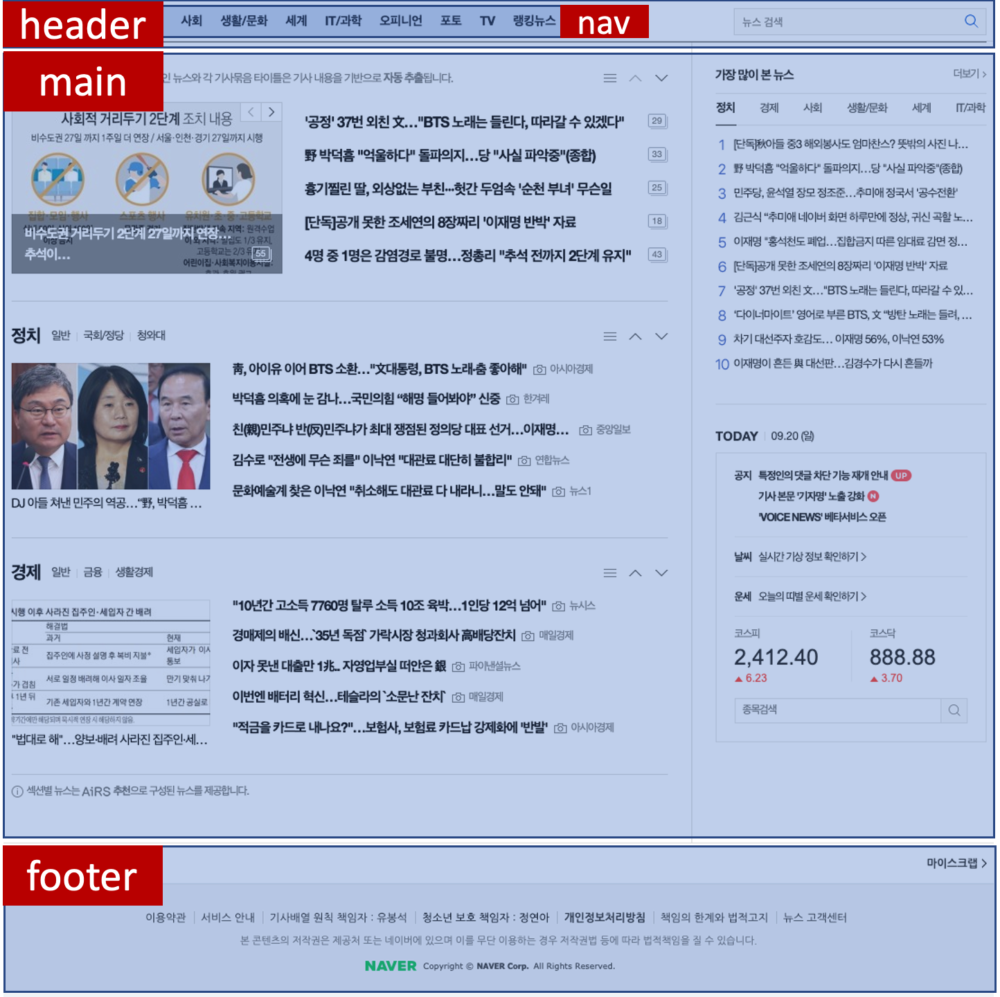
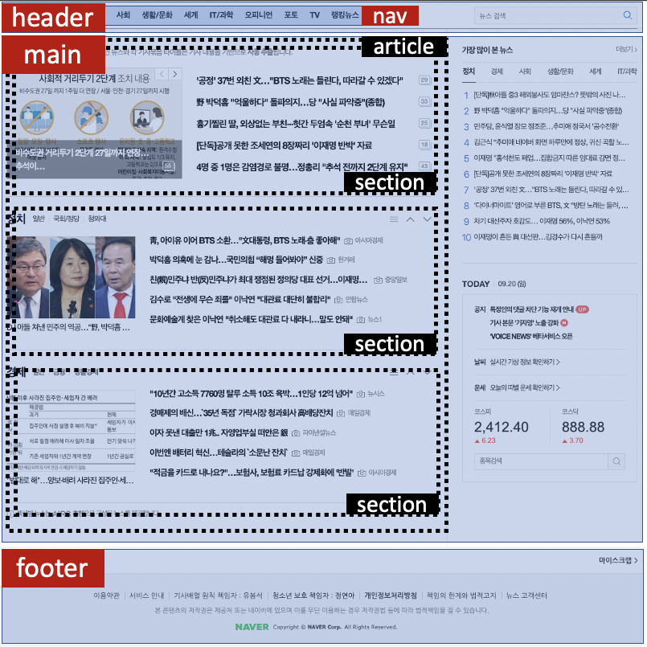
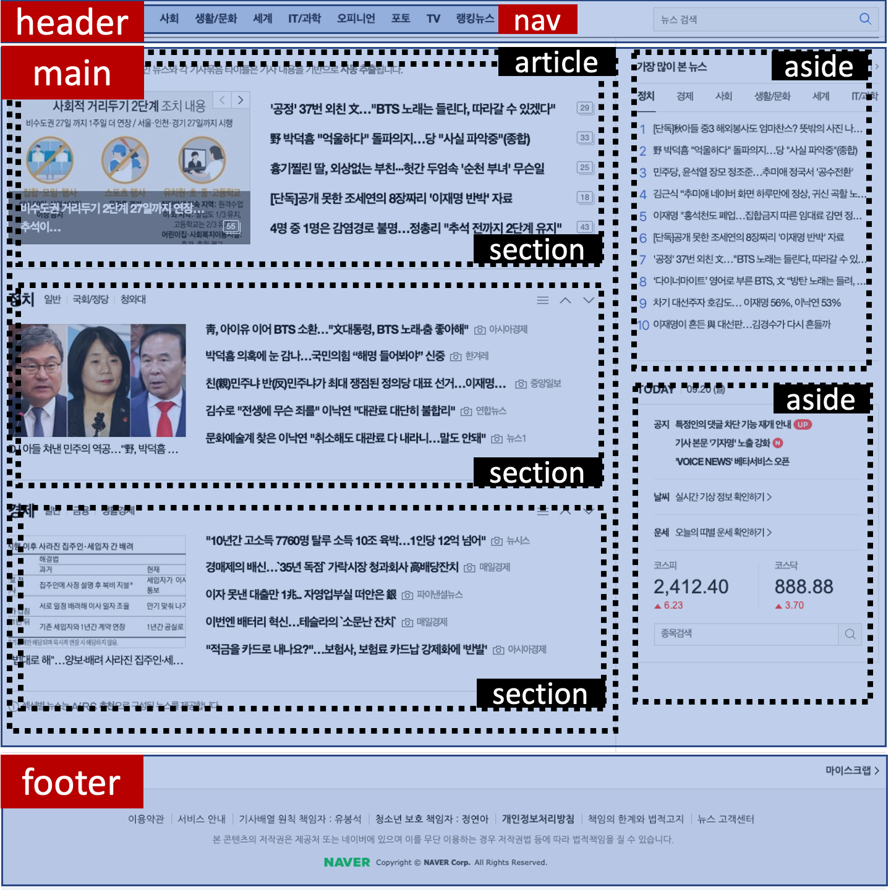

HTML 태그들은 브라우저가 컨텐츠를 어떻게 보여줘야할지`(display)` 알려주기 위해 사용됩니다.

일반적인 HTML 태그들은 내부의 컨텐츠가 어떤 `type`이고, 해당 페이지에서 어떤 역할`(role)`을 맡고 있는지에 대해선 알려주지 않습니다.

하지만 HTML5에서 추가된 Semantic 태그들을 사용하면 어떤 tag의 컨텐츠가 메인이고, 글이고, 사이드고, 네비게이터인지 알려줄 수 있습니다.

이 정보들은 검색엔진 로봇/크롤러가 사이트를 이해하는데에 큰 도움이 됩니다!

또한 시각장애가 있는 사람들이 Screen reader를 통해 사이트에 접근할 때도 많은 도움이 됩니다.

## 예시

```html
<div></div>
<span></span>
```

<center>Non-semantic / generic tags</center>

div와 span은 대표적인 `non-semantic html element`입니다. 내부의 컨텐츠를 감싸는 역할만 수행하며, 역할에 대해 전혀 설명해주지 않습니다.

<br>

```html
<header></header>
<footer></footer>
<nav></nav>
<article></article>
```

<center>semantic tags</center>

Screen reader나 Search bot에게 컨텐츠의 역할(`header`, `footer`, `nav`, `article`)에 대해서 설명해줍니다.

## Semantic HTML5 tag의 종류

다음은 HTML5의 Semantic tag 목록이다. [출처](https://www.w3schools.com/tags/ref_byfunc.asp)

<br>

- **`header`** : document나 section의 `header`를 정의한다.

- **`nav`** : 다른 페이지로 navigate하는 `link`들을 모아놓는다.

- **`main`** : 헤더,푸터,사이드바,메인네비게이션을 제외한 페이지의 body를 정의한다. `한 페이지당 1개만` 존재해야한다.

- **`article`** : 사이트와 별개로 `독립적으로 존재`할 수 있는 컨텐츠 자체를 정의한다. (ex : 블로그 포스트, 뉴스 기사, ...)

- **`section`** : 한 내용에 대한 컨텐츠들을 `grouping`하기 위해 사용된다. 독립적으로 존재할 수 없다는 점에서 article 태그와 다르다.

- **`aside`** : 보충 설명 역할을 하는 덜 중요한 컨텐츠들을 정의한다. `Sidebar`에 자주 쓰인다.

- **`footer`** : document나 section의 `footer`를 정의한다.

이러한 태그들을 적절히 사용해주면 검색엔진 로봇이 사이트를 정확하게 색인하는데 많은 도움이 된다!

위의 태그들은 모두 `<div>` 태그와 완전히 `동일하게 작동`하기 때문에, 기존에 사용된 div 태그들을 Semantic 태그로 교체해도 레이아웃에 영향을 주지 않는다.

그래서 이미 구현된 사이트에도 쉽게 적용할 수 있다. 😄

## 적용해보기

일부 컴포넌트를 제거한 네이버 뉴스에 Semantic tag를 적용해보겠다.

<br>



#### 1. 기본 : header, nav, main, footer



<br>

가장 기본적인 분류만 마친 상태다!

부정확한 분류는 오히려 검색엔진 로봇이 사이트를 잘못 판단하게 만들어 사이트 `노출 및 색인에 악영향`을 끼칠 수 있기 때문에, 애매하게 느껴진다면 차라리 `단순하고 정확`하게 분류하는 편이 좋다.

#### 2. article, section 적용



<br>

main 컨텐츠에 대한 분류가 더 추가된 상태다.

main 태그 안의 중요한 컨텐츠인 **기사 목록**을 감싸는 article 태그가 추가됐다. article 태그는 해당 부분에 대한 `topic`을 제공한다.

또, article 태그 내부의 section들을 통해 해당 article에 대한 `sub-topic`을 포함시켰다.

#### 3. aside 적용



<br>

우측의 컨텐츠들을 aside 태그로 감싸줬다.

aside 태그는 해당 컨텐츠가 `optional`함을 나타낸다. aside 태그 안의 내용이 없어도 유저가 main 컨텐츠를 이해하는데 지장이 없다는 뜻이다.

위의 예시에선 aside 태그가 article 태그 `외부`에 있는데, article 내용과 밀접하게 관련이 있다고 판단되면 내부에 배치해도 된다!

<br>

> 더 많은 Semantic 태그들이 있지만, 이 정도만 적용해도 SEO를 적절히 대응할 수 있습니다. 😁

<br>

### Refs

- [HTML5 Semantic Tags: What Are They and How To Use Them!](https://www.semrush.com/blog/semantic-html5-guide/)
- [시멘틱 태그 Semantic Tag](https://kutar37.tistory.com/entry/%EC%8B%9C%EB%A9%98%ED%8B%B1-%ED%83%9C%EA%B7%B8-Semantic-Tag)
