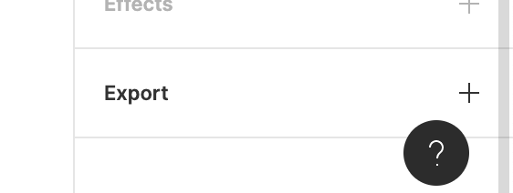
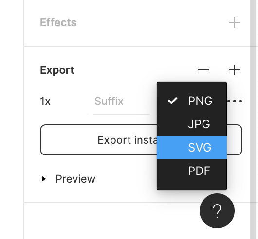
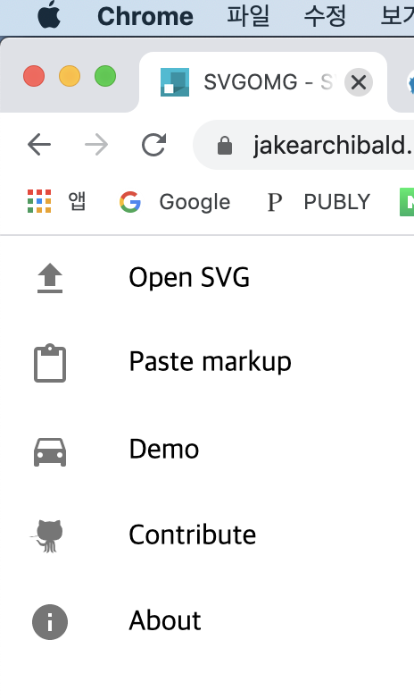
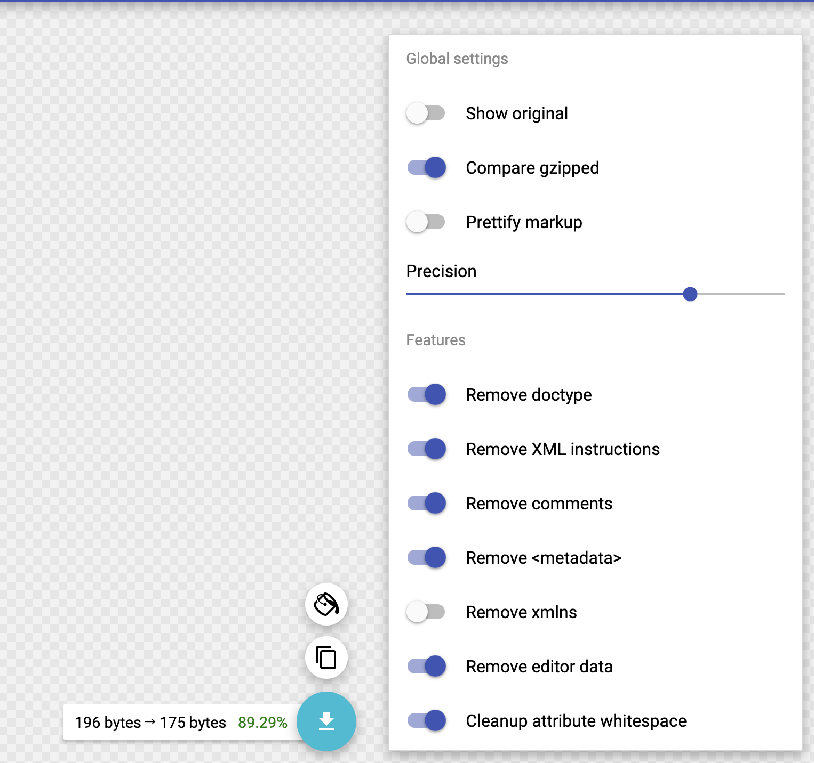

요즘 Figma 덕분에 디자인 진입장벽이 많이 낮아졌죠. 개발자들도 이제 간단한 페이지 디자인 제작 및 수정 정도는 직접 할 수 있는 시대가 온 것 같습니다.

디자인을 구현하다보면 svg나 png 같은 `asset` 파일이 필요한 순간이 많은데요, Zeplin과 다르게 Figma에서는 asset 파일을 추출하는 방법이 잘 보이지 않아 정리해봅니다!

### 1. 추출하고하자하는 아이콘을 누른다,

### 2. 우측 도구모음 하단 export를 누른다,

### 3. 옵션을 svg로 변경한다,

### 4. 다운 후 코드가 길거나 더럽다면 [SVGOMG](https://jakearchibald.github.io/svgomg/) 사이트로 들어가서 받은 svg를 드롭한다,

### 5. 옵션값을 다음과 같이 맞추고 재다운한다.

