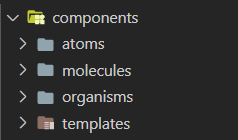
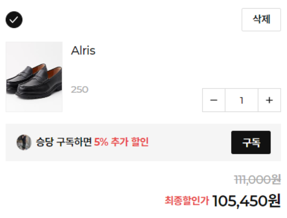
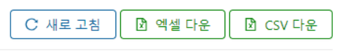

요즘 프론트엔드에 대한 관심이 많아지면서, 아토믹 디자인을 배우고 적용하려는 사람도 늘어난 것 같다.

작년 초에 내가 처음 아토믹디자인 도입을 고려할 때만해도 인터넷에서 아토믹 관련 정보를 거의 찾아보기 힘들 정도로 비주류였는데, 이젠 꽤나 위상이 높아져 첫 컴포넌트 디자인 패턴으로 아토믹 디자인을 배우는 사람들도 종종 보인다.

그러나 아토믹 디자인은 생각보다 문제점이 많다. Redux, Mobx등의 라이브러리와 다르게 확실한 가이드/예시를 찾아보기 힘들고, 실제 서비스에 적용된 사례가 얼마 없기 때문에 더욱 그렇다.

이 글에선 아토믹 디자인에 대한 간단한 설명과 함께 실제 서비스에 적용하면서 있었던 문제점, 내가 느낀 한계점들을 공유해보겠다.

_<i>~~!주의!~~ : 이 글은 기획자, 디자이너와 함께 팀단위로 진행되는 프로젝트를 기준으로 작성됐다. 혼자서 진행하는 개인 프로젝트에는 한번쯤 재미로 도입해보기 좋은 방법론이라고 생각한다.</i>_

## 아토믹 디자인은 왜 인기가 많나요?

 

아토믹 디자인의 최대 장점은 바로 ~~간단 명료하다~~는 것이다.

Atom, Molecule, Organism, Template, Page라는 이름으로 컴포넌트들을 분류하고, 이들이 합쳐져 상위 레벨의 컴포넌트를 완성하는 구조는 그럴싸하고, 직관적이고, 멋지다.

또한 UI의 복잡성을 효과적으로 억제할 수 있다. 중복되는 컴포넌트를 줄일 수 있고, 결과적으로 개발소요시간을 단축할 수 있다.

만들어진 컴포넌트들을 나열해보면 멋지고 체계적인 컴포넌트 테이블을 만들 수도 있다.

- 참고 자료 : [쏘카 프레임](https://socarframe.socar.kr/8bb3aba4a/p/5857a5-socar-frame), [아틀라시안 디자인시스템](https://atlassian.design/components/toggle/examples)

## 아토믹 디자인 외않해?

앞에서 봤듯이 아토믹 디자인은 정말 많은 장점들을 가지고 있다.

그렇다면 왜 아토믹디자인을 실무에 적용한 회사는 찾아보기 힘든 것일까?

### 1. 러닝 커브가 매우 높다. (for 비개발자)

기본적으로 아토믹 디자인은 ~~컴포넌트 개념에 대한 높은 이해도~~를 필요로 한다.

각 컴포넌트들을 어떻게 분류할지가 꽤나 모호하고 논의할 여지가 많다. 예시와 함께 설명하겠다.

 

**1) 비슷하게 생겼지만 다른 분류의 컴포넌트가 존재한다.**

예를 들어, 위의 이미지에서 삭제버튼은 ~~atoms/button~~으로, 구독버튼은 ~~molecules/button/channel-subscribe~~로 구현했다.

구독버튼은 일반적인 버튼들과 다르게 **구독중이라는 state를 가지며, 이에 따라 다르게 작동**하기 때문이다. (구독중이 아닐 땐 구독, 구독중일 땐 구독취소)

~~atoms/toggle-button~~이라는 분류를 추가하는 방법도 생각해볼 수 있겠지만, 모든 토글버튼이 구독버튼과 동일하게 기능할 것이라고 기대하기 힘들기 때문에 현실적으로 어렵다.

 

**2) UI/UX가 모두 상당히 유사하지만, 개발 복잡도 때문에 분리하는게 나은 경우도 있다.**

컴포넌트의 특성과 관계 없이 순전히 개발적인 이유에서 분류를 바꿔야하는 경우도 있다.

위의 이미지는 핔 파트너 어드민의 테이블 상단에서 사용되는 버튼들이다.

여기서 새로고침버튼은 ~~atom~~이고 엑셀/CSV 다운로드버튼은 ~~molecule~~이다.

이유는 엑셀/CSV 다운로드버튼의 click handler function이 다른 버튼들보다 훨씬 거대하기 때문이다.

테이블의 data를 알맞게 formatting하는 함수, 전화번호/가격 등의 값들을 보기 좋게 parsing 하는 함수가 필요해 로직이 굉장히 길다.

atoms/button을 사용하면 이런 함수들을 모두 parent 컴포넌트에 위치시키고 onClick prop으로 전달해야한다..

parent 컴포넌트의 코드가 불필요하게 복잡해지기 때문에 분리할 수 밖에 없다.

 

**3) 이 모호하고 복잡한 분류를 기획자/디자이너가 설계해야한다.**

여기서 문제는 아토믹디자인이 컴포넌트 단위 디자인 및 개발을 실현하기 위해서, ~~설계를 기획자/디자이너가 맡아야한다~~는 것이다.

프론트엔드 이해도가 없는 신입 디자이너와 함께하고 있다면, 그들에게 **컴포넌트 단위의 체계적인 UI 설계를 기대하긴 정말 힘들다.**

React 컴포넌트의 state, prop 개념은 생각보다 비개발자가 100% 이해하기 어렵다.

어떤 컴포넌트가 스스로 데이터를 fetch할 수도, prop으로 전달받을 수도 있다는 것과 이 두 가지의 케이스별 구분 방법을 비개발자에게 온전히 이해시키는 것은 매우 힘들거나 불가능에 가깝다.

하지만 아토믹디자인을 제대로 적용하기 위해선 기획/디자인 단계에서부터 컴포넌트 단위의 체계화된 설계가 이뤄져야한다.

결국 당신은 체계적인 시스템을 완성하기 위해 모든 UI 논의 회의에 참석해야할 것이다.

이는 매우 비효율적이며, 기획자/디자이너에게 컴포넌트 분류에 대해서 설명해야하기 때문에 오히려 **의사소통 비용이 증가한다.**

### 개발자에게도 러닝 커브가 높다.

세상에는 아토믹 디자인을 아는 개발자보다 모르는 개발자가 훨씬 많다.

새로운 개발자가 합류할 때마다 이 모호한 체계를 학습시켜야하며, 이는 학습 비용의 증가로 이어진다.

또 작은 컴포넌트 단위들을 합쳐 상위 레벨의 컴포넌트를 완성한다는 아토믹 디자인의 기본 철학은, 바꿔 말하면 ~~상위 레벨의 컴포넌트를 만들기 위해 프로젝트 내에 존재하는 모든 작은 컴포넌트들을 학습하고 고려해야한다는 것~~이다.

새로 합류한 개발자에게 이를 알려주기 위해 기존 방식보다 훨씬 많은 문서와 예시가 필요할 것이다.

### UI 변화에 유연하지 않다.

기획/디자인의 전 과정이 컴포넌트 단위로 철두철미하게 이뤄진다면 정말 좋겠지만, 대부분의 경우엔 그렇지 않다.

기획/디자인 변경에 따라 서로 다른 두 컴포넌트를 하나로 합쳐야할 수 있고, 그 반대의 상황도 있을 수 있다.

또한 폰트 사이즈, 두께 등의 사소한 변경점들이 컴포넌트 체계에 치명적인 영향을 줄 수도 있다. 기획자/디자이너는 state/prop에 대한 이해도가 낮거나 없을 것이기 때문이다.

## 결론 : 아토믹 디자인, 아직은 빛 좋은 개살구

아토믹 디자인은 멋지고 직관적인 것처럼 보이지만, 충분한 고민 없이 도입한다면 러닝커브가 너무 높아 오히려 의사소통에 장애가 되기 쉽습니다.

적은 인원이 진행하는 토이 프로젝트라면 상관 없지만, 다양한 포지션의 여러 팀원이 협업하는 환경이라면 아토믹 디자인을 **사용하지 않기를 권장합니다.**

### Refs

- [Atomic Design - written by Brad Frost](https://atomicdesign.bradfrost.com/table-of-contents/)
- [아토믹 디자인 패턴으로 디자이너와 협업하기 - by Joy Kim](https://speakerdeck.com/feel5ny/atomig-paeteoneuro-dijaineowa-hyeobeobhagi)
- [atomic design 파헤치기 - 심삼재](https://simsimjae.tistory.com/407)
