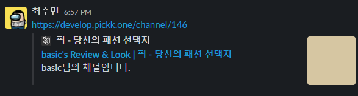

HTML의 head는 페이지를 열 때 웹 브라우저에 표시되지 않습니다.

head는 ~~\<title\>~~ 같은 페이지나, CSS의 링크, 파비콘, 메타데이터 등을 포함합니다.

제대로 정의되지 않은 HEAD는 웹페이지 SEO에 정말 안 좋은 영향을 끼칩니다.

이 문서에서 소개되는 기본적인 태그들은 꼭 숙지하고 추가해주시는게 좋습니다!

## 기본 + 메타 태그들

1. title : 문서의 제목을 나타냅니다.
2. link canoniccal : 해당 문서에 접근하는 대표 url을 나타냅니다. 여러 경로가 가능하더라도 unique한 값을 갖도록 설정해야합니다.
3. meta - description : 해당 문서에 대한 설명입니다. 최대 60자 정도를 권장합니다.
4. meta - keywords : 문서의 키워드를 쉼표로 분리하여 표시합니다.
5. meta - author : 문서의 작성자를 표시합니다. 블로그 글의 작성자 같은 개념이 아닌, HTML 문서를 생산한 사람이라는 의미이기 때문에 보통 서비스 이름을 적습니다.
6. meta - robots : 이 문서에 대한 색인을 허용하는가를 나타냅니다. noindex로 설정시 색인하지 않습니다.

```tsx
<title>basic's Review & Look | 핔 - 당신의 패션 선택지</title>
<link rel="canonical" href="https://pickk.one/channel/146" />
<meta name="description" content="basic님의 채널입니다." />
<meta
  name="keywords"
  content="핔사이트,픽사이트,깡스타일리스트,진진호,키작은광자,식스타일,호수,맨투맨,데님팬츠,니트,스니커,로맨틱무브,더니트컴퍼니,커스텀어클락,가먼트레이블,벨리에,수아레,낫앤낫,페이탈리즘,피스워커,모드나인,메종미네드,커렌트,페이브먼트,"
/>
<meta name="author" content="핔 - 당신의 패션 선택지" />
<meta name="robots" content="index,follow" />
<meta name="googlebot" content="index,follow" />
```

## Open Graph 태그들

Open Graph는 페이스북에서 만든 웹페이지 메타 태그 프로토콜입니다.

카카오톡, 페이스북, 트위터 등 많은 서비스의 봇들이 오픈 그래프를 사용중이니 꼭 설정해주시는게 좋습니다!

```tsx
<meta property="og:title" content="basic's Review &amp; Look | 핔 - 당신의 패션 선택지">
<meta property="og:description" content="basic님의 채널입니다.">
<meta property="og:image" content="https://d1u5g7tm7q0gio.cloudfront.net/images/20200823211602021.jpg">
<meta property="og:image:width" content="800">
<meta property="og:image:height" content="800">
<meta property="og:locale" content="ko_KR">
<meta property="og:site_name" content="핔 - 당신의 패션 선택지">
<meta property="og:type" content="website">
<meta property="og:url" content="https://pickk.one/channel/146">
```

<br>



<center>Open Graph가 적용된 예시입니다.</center>
