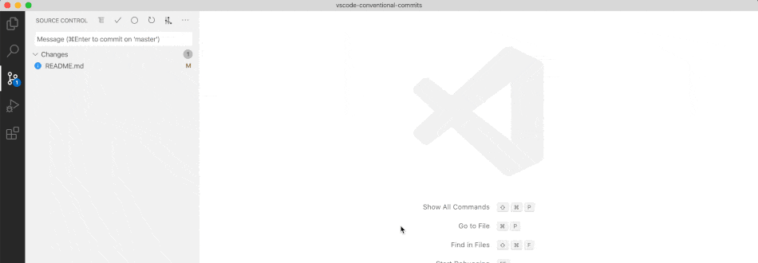

## 소개

vscode의 매력은 여러가지 extension들을 통해서 쉽고 빠르게 커스터마이징할 수 있다는 점인 것 같습니다.

제가 유용하게 사용중인 10가지를 소개해보겠습니다~

## 1. Eslint

- 추천도: 5

javascript library인 Eslint와 vscode를 연결해줍니다.

ESLint는 코드 포맷팅/품질 정적 분석 도구입니다. 타입을 명시하지 않았다던가, 지역변수를 선언해놓고 사용하지 않는 등 개발할 때 발생할 수 있는 실수들을 미리 지적해주는 역할입니다.

주로 코드 품질 관리를 위해서 사용하고, 포맷팅은 Prettier로 처리합니다.

ESLint에 대한 자세한 설명은 [여기](https://eslint.org/)로

## 2. Prettier

- 추천도: 5

javascript library인 Prettier와 vscode를 연결해줍니다.

Prettier는 코드 포매터입니다. 파일을 저장할 때마다 Indentation, 줄바꿈, 세미콜론 등을 알아서 미리 입력한 값으로 설정해줍니다.

## 3. Conventional Commits

- 추천도: 4

[Conventional Commits](https://www.conventionalcommits.org/en/v1.0.0/) for VSCode.

형식에 맞고 이쁜 커밋 메세지를 쉽게 작성할 수 있도록 도와주는 툴입니다.

## 4. Material Icon Theme

- 추천도: 3.5

file tree 아이콘들을 이쁘게 바꿔줍니다 🌼

## 5. MDX

- 추천도: 3.5

.mdx 파일들에 대한 syntax-highlighting 기능을 제공합니다.

이게 없으면 mdx 파일의 글씨 색이 모두 흰색으로 보이며 auto formatting도 작동하지 않습니다.

## 6. XML Tools

- 추천도: 4.5 or 2.5

XML 포맷팅, XML tree view를 제공합니다.

이게 없으면 XML 파일들의 줄바꿈이 뒤죽박죽이 되기 때문에 강력 추천합니다.

앱 플랫폼별 설정 파일들 중 XML 파일들이 많기 때문에 앱 개발을 맡게 된다면 반 필수입니다.

## 7. Auto Rename Tag

- 추천도: 4.5

Auto rename paired HTML/XML tag

## 8. ES7 React/Redux/GraphQL/React-Native snippets

- 추천도: 2.5

단축키로 저장된 snippet들을 쉽게 입력할 수 있습니다. (ex : imr → import React from 'react')

## 9. Git Graph

- 추천도: 2.5

깃 커밋 히스토리를 그래프 형식으로 보여줍니다. 가끔 여러개의 브랜치를 사용하다가 작업 흐름이 꼬였을 때 참고하면 편리합니다.

## 10. Live Share

- 추천도: 3

실시간으로 여러 명이 같은 에디터를 원격 공유하도록 해줍니다. 재택근무중인 인원과 코드 로직에 대해 디테일한 논의를 하고 싶을 때 유용합니다.
