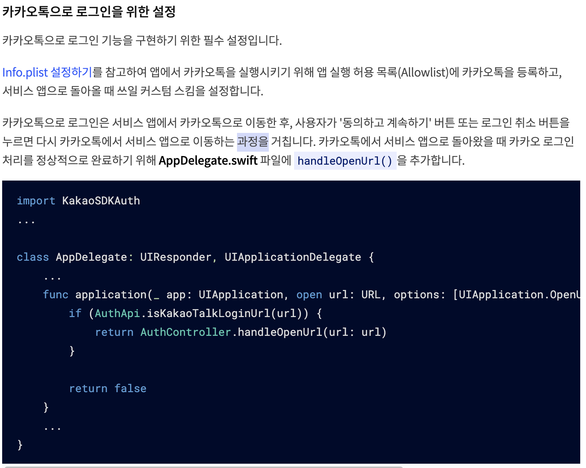

## 카카오 로그인, 어떤 라이브러리를 사용해야할까?

kakao developers 페이지에 들어가보면 각종 카카오 서비스 관련 기능을 붙이기 위한 SDK가 제공된다.

이 SDK를 직접 활용해 프로젝트에 붙이는 방법도 있지만, 대부분 편의를 위해 라이브러리를 사용할 것이다.

그렇다면 어떤 라이브러리를 사용해야할까? react native kakao login을 키워드로 검색해보면 다음 3가지 라이브러리가 나온다.

1. [@react-native-seoul/kakao-login](https://www.npmjs.com/package/@react-native-seoul/kakao-login): Weekly Downloads 459
2. [rn-kakao-login](https://www.npmjs.com/package/rn-kakao-login): Weekly Downloads 69
3. [@actbase/react-native-kakao-login](https://www.npmjs.com/package/@actbase/react-native-kakao-login): Weekly Downloads 60

<br>


이 중 **rn-kakao-login**은 더 이상 유지되지 않기 때문에 제외한다.

**@react-native-seoul/kakao-login**이 더 많이 사용되지만, Legacy SDK 기반의 Object-C++ 코드기 때문에 `웹과 스키마가 다르다.`


또 카카오에서도 조만간 중단되니 `가급적 쓰지말라`고 한다.. 따라서 이를 선택하는 것은 너무 위험하다고 판단했다.

KakaoSDK v2 기반의 Swift 코드인 **@actbase/react-native-kakao-login**가 매우 매력적이지만 문서화가 매우 빈약하고 버그가 존재해 사용하기 쉽지 않다.

이번 포스트에선 **@actbase/react-native-kakao-login**를 도입하기 위해 필요한 과정과 해결해야할 버그에 대해서 설명해보겠다.

## 소개

별도 라이브러리를 설치하지 않아도 된다.

RN 0.60 이상 버전에서만 호환되며, Pod이 필수다.

## Getting Started

```shell
$ yarn add @actbase/react-native-kakao-login
```

<br>

## Post Installation

### iOS

1. 프로젝트의 ios 폴더에서 Pod 설치 명령어를 실행합니다.

```shell
$ npx pod install
```

2. `/ios/Podfile` 파일의 플랫폼 버전을 11.0 이상으로 설정해야합니다.

```shell
platform :ios, '11.0'
```

3. [공식문서 - 앱생성](https://developers.kakao.com/docs/latest/ko/getting-started/app)을 참고해 앱을 생성합니다.
4. Project => Targets 아래 앱 선택 => General 탭으로 이동해서 Bundle Identifier가 본인의 카카오 앱과 동일한지 확인해주세요.
5. [공식문서 - 개발 프로젝트 설정](https://developers.kakao.com/docs/latest/ko/getting-started/sdk-ios)을 참고하여 Info.plist, URL Schemes 설정을 완료합니다.
6. (2021/01/27 추가) iOS에서 기기에 미리 설치된 카카오톡을 이용해 로그인할 수 없는 버그가 있었는데요, 리서치 결과 공식 가이드에서 아래 내용을 찾을 수 있었습니다.



찾아보니 다행히 이 라이브러리에도 위 상황을 대응하기 위한 모듈이 존재하네요. `AppDelegate.m`에 아래 내용을 추가해 쉽게 해결할 수 있습니다.

```objectivec
#import <ARNKakaoLogin/ARNKakaoLoginConnector.h>

- (BOOL)application:(UIApplication *)application openURL:(NSURL *)url
                                       sourceApplication:(NSString *)sourceApplication
                                              annotation:(id)annotation {
    if([ARNKakaoLoginConnector isKakaoTalkLoginUrl:url]) {
      return [ARNKakaoLoginConnector handleOpenUrl: url];
    }

    return NO;
}
```

### Android

1. [공식문서 - 개발 프로젝트 설정](https://developers.kakao.com/docs/latest/ko/getting-started/sdk-android)에서 초기화, v1->v2 마이그레이션을 제외한 모든 설정을 완료합니다.
2. `/android/app/src/main/AndroidManifest.xml` 파일내에 다음 내용을 추가합니다. (app_key가 123412341234라면 "123412341234")

```xml
<meta-data android:name="com.kakao.sdk.AppKey" android:value="{YOUR_APP_KEY}" />
```

3. `/android/build.gradle` 파일에서 Android API 버전을 19 이상으로 설정합니다.

```shell
buildscript {
    ext {
       minSdkVersion = 19
    }
```

<br>

## 사용법

예시 코드로 대체한다.

```tsx
import KakaoLogin from '@actbase/react-native-kakao-login';

...

const login = () => {
  KakaoLogin.login()
    .then((result) => {
      getProfile();
      console.log(`Login Finished:${JSON.stringify(result)}`);
    })
    .catch((err) => {
      if (err.code === 'E_CANCELLED_OPERATION') {
        console.log(`Login Cancelled:${err.message}`);
      } else {
        console.log(`Login Failed:${err.code} ${err.message}`);
      }
    });
};

const getProfile = () => {
  KakaoLogin.getProfile()
    .then((result) => {
      signIn(navigation, {
        providerType: ProviderType.Kakao,
        providerId: result.id.toString(),
      });
    })
    .catch((err) => {
      console.log(`Get Profile Failed:${err.code} ${err.message}`);
    });
};
```

<br>

## 버그 수정 (타입스크립트)

```tsx
  export interface ARNKakaoLogin {
    getAccessToken: () => Promise<null | AccessTokenType>;
    login: () => Promise<null | AccessTokenType>;
    loginWithNewScopes: (scopes: string[]) => Promise<null | AccessTokenType>;
    getProfile: () => Promise<ProfileType>;
    logout: () => Promise<'SUCCESS'>;
    unlink: () => Promise<'SUCCESS'>;
  }

  export default ARNKakaoLogin;
}
```

**error TS2693: 'KakaoLogin' only refers to a type, but is being used as a value here.**

모듈의 타입 선언 파일(index.d.ts)에서 default export를 interface로 하고 있어 타입 에러가 발생한다.

깃헙 레포지토리에 수정 PR을 날려볼 수도 있겠으나, 최근 업데이트가 21일 전이기 때문에 언제 반영될지 기약이 없다.

따라서 임시로 처리해줘야한다! 직접 타입 선언 파일을 작성해서 덮어 써주자.

1. `/__types__/actbase__react-native-kakao-login/index.d.ts` 파일을 생성한 뒤, `/node_modules/@actbase/react-native-kakao-login/index.d.ts` 파일의 내용을 복사해넣는다.
2. 생성한 파일의 마지막 부분을 다음과 같이 바꾼뒤 저장한다.

```tsx
  export interface ARNKakaoLogin {
    getAccessToken: () => Promise<null | AccessTokenType>;
    login: () => Promise<null | AccessTokenType>;
    loginWithNewScopes: (scopes: string[]) => Promise<null | AccessTokenType>;
    getProfile: () => Promise<ProfileType>;
    logout: () => Promise<'SUCCESS'>;
    unlink: () => Promise<'SUCCESS'>;
  }

  const KakaoLogin: ARNKakaoLogin;

  export default KakaoLogin;
}
```

3. `/tsconfig.json`에 다음 내용을 추가한다.

```json
{
  "paths": {
    "@actbase/react-native-kakao-login": [
      "__types__/actbase__react-native-kakao-login"
    ]
  },
  "typeRoots": ["./__types__"],
  "exclude": ["__types__"]
}
```

### Q) 왜 타입 선언을 덮어쓰는 방식으로 해결했나요??

이 문제를 해결하는 방법은 내가 알기로 4가지가 있다.

1. 타입 선언을 덮어쓴다.
2. 해당 패키지 레포에 PR을 날리고, 반영되길 기다린다.
3. 패치를 추가한다.
4. 패키지 코드를 다운 받아 버그를 고치고 내 이름으로 배포해 사용한다.

일단 2번은 즉시 적용할 수 없으므로 제외다.

3번도 꽤나 괜찮은 방법이다. 실제로 많은 개발자들이 이 방식을 사용해 문제가 있는 라이브러리에 대해 능동적으로 대처하고 있다. [방법 링크](https://medium.com/naver-place-dev/patch-package%EB%A5%BC-%ED%99%9C%EC%9A%A9%ED%95%9C-npm-%ED%8C%A8%ED%82%A4%EC%A7%80-%ED%8C%A8%EC%B9%98-patch-%EC%82%AC%EB%A1%80-feat-react-native-ee1fc399b7c2) 하지만 내가 선택하지 않은 2가지 이유가 있다.

1\. 패키지 설치 과정에 patch-package를 끼워넣고 싶지 않다. 괜히 프로젝트가 무거워지는 느낌이다.<br>
2\. 귀찮다. 모듈내 코어 로직에 결함이 있는 것도 아니고, 타입 선언 한두줄 잘못된건데 배보다 배꼽이 큰 것 같다.<br>

4번은 위의 4가지 중 최악의 방법이다. 해당 패키지에 버그가 있어 업데이트해야할 경우 내 이름으로 배포된 패키지의 코드를 귀찮게 수정해야하기 때문이다. 버그 수정이 아닌 기능 보강 등 정말 필요할 때만 선택하도록 하자.

<br>

위와 같은 이유에서 빠르고 쉬운 1번 방법으로 이번 문제를 해결해봤습니다.

물론 이번 문제는 타입 선언 파일에만 작은 문제가 있었어서 야매로 해결할 수 있었던 것이고, 코드 자체에 문제가 있는 경우 2번 또는 3번 방법을 사용해야 합니다!
