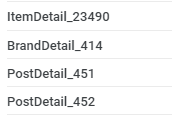

## Firebase?

Firebase는 고품질 앱을 빠르게 개발하고 비즈니스를 성장시키는 데 도움이 되는 Google의 `모바일 플랫폼`입니다.

Dynamic Link, Cloud Messaging등 여러 편리한 기능들을 지원하기 때문에 웬만하면 애널리틱스도 Firebase도 설정하는 것을 추천합니다!

## 어떤 라이브러리를 사용하나요?

[React Native Firebase](https://rnfirebase.io/)을 사용합니다. 이유는 다음과 같습니다.

1. 사용자 수가 많습니다.
2. 문서화가 아주 잘 되어있습니다.
3. 타입 선언이 잘 되어있습니다.
4. 활발하게 유지보수되고 있습니다.
5. 무료입니다!

[문서화](https://rnfirebase.io/analytics/usage)가 워낙 잘 돼있어서 설정에 대해선 특별히 설명할게 없습니다.<br>
제가 Firebase Analytics를 도입하면서 신경 썼던 점들에 대해서 작성해보겠습니다.

## Screen Tracking - React Navigation

React Native는 기본적으로 하나의 Activity/ViewController에서 작동하기 때문에 native Firebase SDK가 자동으로 screen_view 이벤트를 기록하지 못합니다.

여기서는 React Navigation 라이브러리에 Screen Tracking 로직을 적용하는 방법에 대해서 알아보겠습니다.

```tsx
import analytics from '@react-native-firebase/analytics';
import { NavigationContainer } from '@react-navigation/native';

<NavigationContainer
  ref={navigationRef}
  onReady={() =>
    (routeNameRef.current = navigationRef.current.getCurrentRoute()?.name)
  }
  onStateChange={() => {
    const previousScreenName = routeNameRef.current;

    const currentRoute = navigationRef.current.getCurrentRoute();

    const currentScreenName =  `${currentRoute?.name}_${Object.values(currentRoute?.params || {}).join('/')}`

    if (currentRoute && previousScreenName !== currentScreenName) {
      analytics().logScreenView({
        screen_name: currentScreenName,
        screen_class: currentRoute.name,
      });
    }

    // Save the current route name for later comparision
    routeNameRef.current = currentScreenName;
  }}
>
```

[React Navigation - Screen tracking for analytics](https://reactnavigation.org/docs/screen-tracking/) 문서를 참고한 코드입니다.

<br>



screen_name에 parameter를 붙여 좀 더 디테일하게 tracking 했습니다.

Firebase는 페이지 클래스와 이름을 별개로 수집/관리하기 때문에 위와 같이 기록하면 Funnel 설정 등에서 편하게 사용할 수 있습니다.

## Predefined Events vs Custom Event

이름과 데이터를 직접 설정하는 커스텀 이벤트와 다르게, 기본 이벤트는 말 그대로 Firebase가 미리 정의해놓은 이벤트들입니다.

같은 상황이라면 기본 이벤트를 사용하는게 커스텀 이벤트를 사용하는 것보다 좋습니다. 이유는 다음과 같습니다.

1. 이벤트 유형에 따라 맞춤 보고서가 제공됩니다.
2. 프로젝트당 고유 Parameter를 `최대 50개까지만` 설정할 수 있습니다.

커스텀 이벤트를 남용하면 Parameter 개수제한에 걸려 애써 수집한 데이터를 날릴 수도 있습니다. 최대한 기본 이벤트로 대응해보세요!

상품 관련 보고서의 기능이 꽤 강력하기 때문에, `logViewItem`/`logPurchase`/`logAddToCart` 등 전자상거래 관련 이벤트들은 꼭 사용해주시면 좋습니다.

<br>

```tsx
export const logViewItem = async (item: IItem) => {
  await analytics.logViewItem({
    items: [ItemSerializer(item)],
  });
};

export const logBeginCheckout = (
  prices: OrderSheetPrice,
  orderSheet: OrderSheet
) => {
  analytics.logBeginCheckout({
    value: prices.totalPaymentPrice,
    currency: 'krw',
    items: orderSheet.order.reduce((items, brand) => {
      return items.concat(
        brand.orderItems.map((orderItem) => ItemSerializer(orderItem))
      );
    }, []),
  });
};
```

Item 관련 기본 이벤트들을 사용한 예시입니다.<br>
프로젝트 내에서 사용되는 상품 object를 Firebase schema에 맞게 `mapping`하는 함수를 미리 구현해놓으면 편합니다!

### Refs

- [React Natiave Firebase - Analytics usage](https://rnfirebase.io/analytics/usage)
- [Firebase Analytics, BigQuery없이 어디까지 가능할까](http://sweettracker.github.io/android/2019/07/15/FirebaseAnalytics.html)
