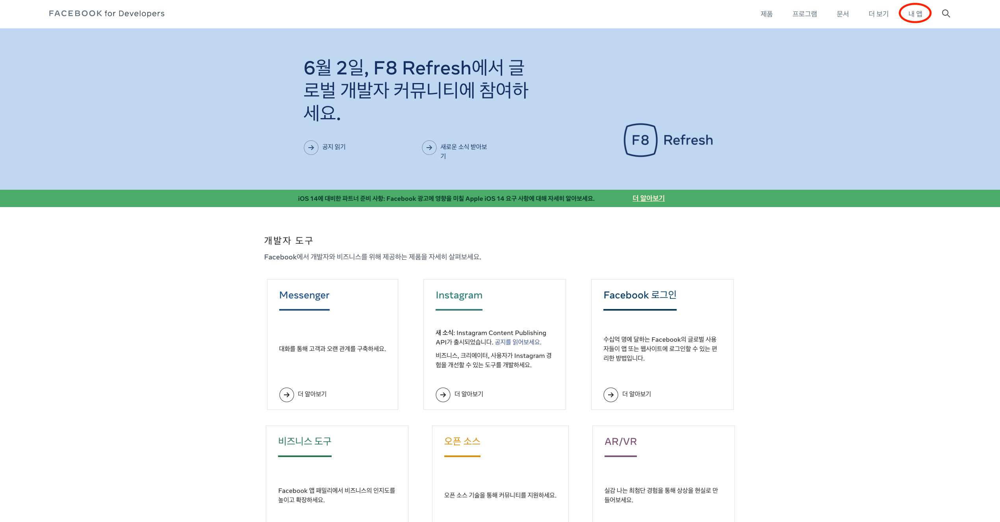
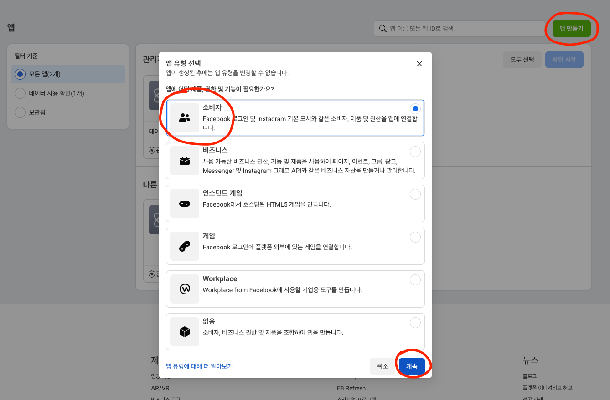
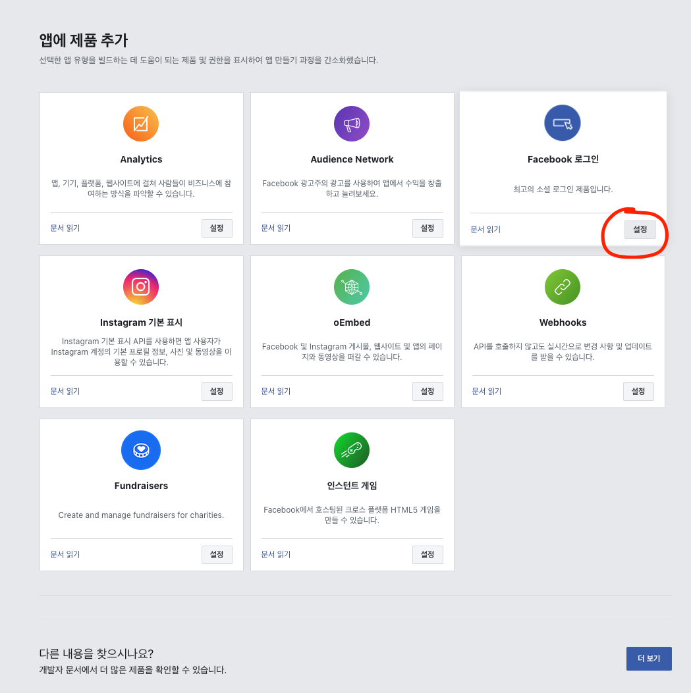
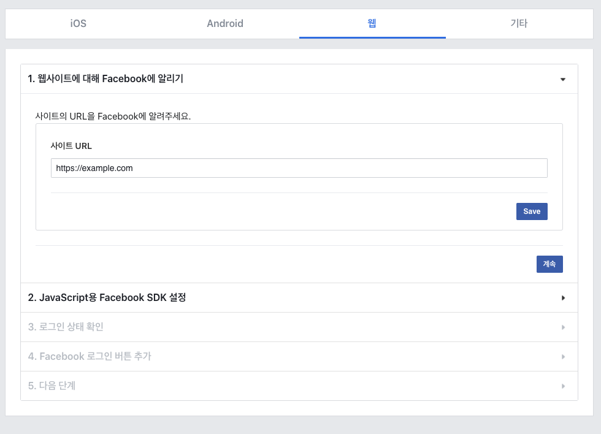
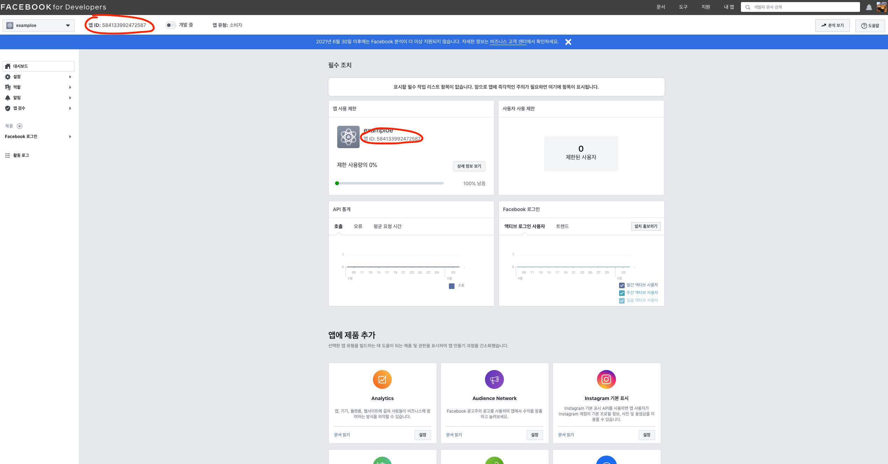
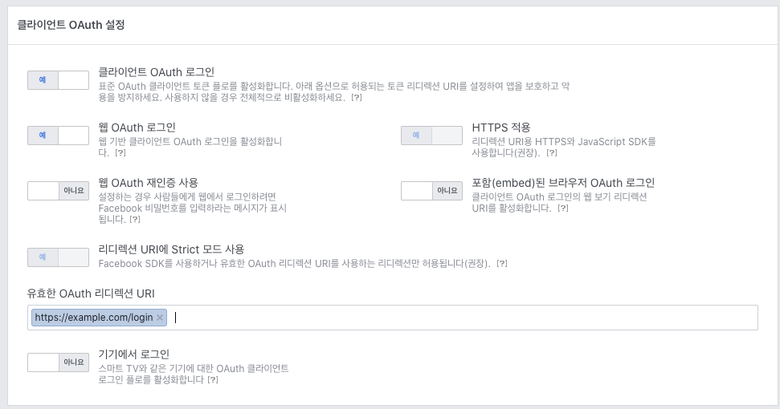

## 페이스북 로그인, 어떻게 구현해야할까?

[페이스북 개발자 사이트](https://developers.facebook.com/?locale=ko_KR)에 들어가보면 페이스북, 인스타그램 관련 기능을 붙이기 위한 SDK들이 제공됩니다.

이 SDK를 직접 활용해 프로젝트에 붙이는 방법도 있지만, 일반적인 상황이라면 **편의와 안정성**을 위해 외부 패키지를 사용하는게 좋습니다!

패키지를 사용하면 SDK를 직접 분석하고 사용하는 **시간을 절약**할 수 있고, 다른 사용자에 의해 **에러가 미리 발견**될 수 있기 때문입니다.

그렇다면 어떤 패키지를 사용해야할까요?

[react-facebook-login](https://www.npmjs.com/package/react-facebook-login)이 널리 쓰이지만, 저는 제가 만든 [@greatsumini/react-facebook-login](https://www.npmjs.com/package/@greatsumini/react-facebook-login)를 추천합니다! 이유는 다음과 같습니다.

| 이름                              | 용량    | 타입 지원 | 문서 지원 | 마지막 배포   |
| --------------------------------- | ------- | --------- | --------- | ------------- |
| react-facebook-login              | 239kB   | ❌        | ❌        | 3년 전 (중단) |
| @greatsumini/react-facebook-login | 27.5 kB | ✅        | ✅        | 2시간 전      |

<br>

react-facebook-login을 제가 직접 사용하며 느낀 불편함들을 해결하기 위해 만든 패키지입니다.

용량에서 매우 큰 차이가 있고, 타입 및 문서를 지원하기 때문에 훨씬 매력적인 선택지라고 생각합니다!

## 1. 앱 등록하기

[페이스북 개발자 사이트](https://developers.facebook.com)에 접속해 로그인하고, `내 앱`을 클릭합니다.



<br>

`앱 만들기`, `소비자`, `완료`를 클릭하고 필요한 정보들을 입력해 새 앱을 생성합니다.



<br>

리다이렉트된 페이지에서 `Facebook 로그인` - `설정`을 누릅니다. 이후 웹을 선택합니다.



<br>

사이트 URL을 입력합니다.



<br>

이후 단계는 모두 건너뛰시면 됩니다. 축하합니다! 이제 페이스북 로그인을 구현할 모든 준비가 완료되었습니다.

## 2. 앱 ID 확인하기



내 앱 페이지에 접속하면 위 사진의 위치에 ID들이 표시됩니다. 복사해서 사용하시면 됩니다.

## 3. 패키지 설치하기

```shell
$ npm i --save @greatsumini/react-facebook-login
$ # or
$ yarn add @greatsumini/react-facebook-login
```

## 4. 적용하기

```tsx
import FacebookLogin from '@greatsumini/react-facebook-login';

export default function FacebookLoginButton() {
  return (
    <FacebookLogin
      appId="발급받은 앱 ID"
      onSuccess={(response) => {
        console.log('Login Success!');
        console.log('id: ', response.id);
      }}
      onFail={(error) => {
        console.log('Login Failed!');
        console.log('status: ', error.status);
      }}
      onProfileSuccess={(response) => {
        console.log('Get Profile Success!');
        console.log('name: ', response.name);
      }}
    />
  );
}
```

저는 실제로 아래처럼 사용하고 있어요!

```tsx
function FacebookLoginButton({ requestLogin }: LoginButtonProps) {
  return (
    <FacebookLogin
      appId={process.env.FB_APP_ID}
      onProfileSuccess={(response) => {
        requestLogin({
          Provider: ProviderType.Facebook,
          id: response['id'],
        });
      }}
      onFail={() => {
        alert('비정상적인 결과입니다. 다시 시도해주세요!');
      }}
      render={({ onClick }) => (
        <Wrapper onClick={onClick}>
          {/* render prop을 사용할 땐 반드시 onClick을 사용해주세요! */}
          <FacebookIcon
            style={{
              marginRight: '0.8rem',
            }}
          />
          <P level={2} color={WHITE} fontWeight="medium">
            페이스북으로 시작하기
          </P>
        </Wrapper>
      )}
    />
  );
}
```

## 5. 주의할 점

- Facebook SDK는 http 환경에서의 로그인 시도를 차단합니다. 따라서 localhost에선 작동을 테스트할 수 없습니다 😢 Vercel, Netlify등으로 배포한 뒤에 테스트해주세요!
- 미리 입력한 URL에 대해서만 로그인을 진행할 수 있습니다. 사용할 URL을 꼭 미리 등록해주세요! (경로: `내 앱 페이지` - `Facebook 로그인 / 설정` - `클라이언트 OAuth 설정` - `유효한 OAuth 리디렉션 URI`)

  

<br>

여기까지 리액트에서 페이스북 로그인을 간단하게 구현하는 방법에 대해서 알아봤습니다.

더 자세한 옵션들에 대한 정보는 [GitHub 레포지토리](https://github.com/greatSumini/react-facebook-login)에서 확인해주세요! 감사합니다~
