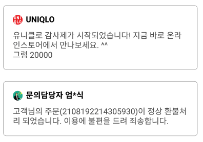
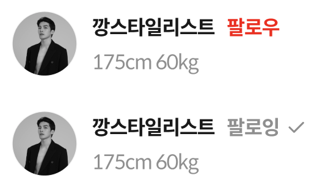

코드 품질 개선에 대한 여러가지 방법론과 접근들이 존재하죠!<br/>
그 중 제가 가장 좋아하는, 직관적인 방법인 '자연어처럼 쓰려고 노력하기'에 대해서 소개해보겠습니다.

말 그대로 코드를 되도록 '자연어'처럼 읽을 수 있도록 작성해보는 방법인데요, 예시들을 통해 알아보겠습니다~

## 예시1: 알림 카드 React Component



위와 같은 UI를 만든다고 가정해보겠습니다. 데이터 스키마는 아래와 같습니다.

```typescript
interface INotification {
  id: number;
  createdAt: Date;
  updatedAt: Date;

  sender: {
    name: string;
    imageUrl: string;
  }

  content: string;
}
```

간단하게 컴포넌트를 작성해보겠습니다. styled 컴포넌트들은 생략하겠습니다.
```tsx
export type NotificationCardProps = Pick<INotification, 'sender' | 'content'>;

export default function NotificationCard({sender, content}: NotificationCardProps) {
  return <Wrapper>
    <Row>
      <SenderImage src={sender.imageUrl} />
      <SenderName>{sender.name}</SenderName>
    <Row>
    <Content>{content}</Content>
  </Wrapper>
}
```

sender를 한번 더 `const {imageUrl, name} = sender;`로 destructuring하지 않은 것이 포인트입니다.

읽는 입장에서 보낸 이의 이미지, 보낸 이의 이름으로 받아들이는 것이 자연스럽기 때문입니다!

## 예시2: 아메리카노 만드는 함수 (with 디자인 패턴)

다양한 디자인 패턴을 적용해볼 수도 있습니다. 언제나 목표는 '자연어처럼 읽기 쉽도록' 만드는 것임을 명심하세요!

```typescript
/**
  아메리카노 만드는 함수.
  컵을 준비하고 원두를 갈아서 넣는다. 그리고 물을 붓는다. 아이스면 얼음을 5개 넣는다.

  자연어처럼 쭉 읽을 수 있다는 점에 집중해주세요.
*/
function makeAmericano(cup: Cup, bean: Bean, waterCapacity = 350, isIce = true) {
  return CoffeBuilder<Americano>() // 아메리카노 커피를 만들건데
    .setCup(cup) // 컵 준비하고
    .addBean(bean) // 원두 넣고
    .addWater(waterCapacity) // 물을 넣고
    .addIce(isIce ? 5 : 0) // 아이스면 얼음 5개 넣는다.
    .build(); // 끝!
}
```

필요에 따라 `addBean` 함수에서 갈아 넣는다는 행위를 좀 더 구체적으로 명시할 수도 있을 것입니다.

## 예시3: Bio 컴포넌트의 toggle 함수



세번째 예시는 흔히 볼 수 있는 Bio 컴포넌트입니다. 위의 UI에서 팔로잉 여부를 전환하는 함수를 구현해보겠습니다.

```tsx
/* 
  이름: toggleFollow
  기능: 현재 팔로잉 상태에 따라 적절한 mutation을 호출한다. (follow or unfollow)
*/

// BAD
const toggleFollow = (value: boolean, targetId: number) => {
	try {
		value
			? unfollow({ variables: { targetId } })
			: follow({ variables: { targetId } });
	// 후략 ...

// GOOD: jsdoc 추가, value -> isFollowing, 비교 statement 변경
/** 현재 팔로잉 상태에 따라 follow or unfollow 호출
 @param isFollowing 현재 팔로잉 상태
 @param targetId 팔로우할 대상 User의 id */
const toggleFollow = (isFollowing: boolean, targetId: number) => {
	try {
		isFollowing === true
			? unfollow({ variables: { targetId } })
			: follow({ variables: { targetId } });
		// 후략 ...
```

개선된 점을 정리해보자면 다음과 같습니다.

1. value parameter의 이름을 isFollowing 변경해 '현재 팔로잉 상태'라는 의미를 보다 명확히 전달
2. 굳이 `isFollowing ?` 대신 `isFollowing === true ?`로 사용해 '현재 팔로잉 중이면~'라는 맥락을 보다 명확히 전달.
3. toggleFollow라는 이름으론 단순 state 변경 함수인지 mutation을 호출하는지 알기 어렵기 때문에 jsdoc 추가

2번은 호불호가 갈릴 것 같긴한데 저는 저렇게 boolean truthy 검사 후 메소드를 실행할 때는 `=== true`를 넣어주면 더 자연스럽게 잘 읽히는 것 같아서 선호합니다 ㅎㅎ (단순 변수를 반환할 때는 사용하지 않습니다. e.g. `isFollowing ? '팔로잉' : '팔로우'`)

## 끝
