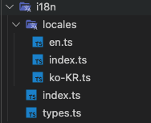
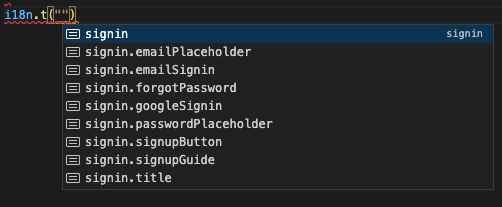

React Native에서 i18n(다국어지원)을 설정하는 방법에 대해서 알아보겠습니다.

[react-native-localize](https://github.com/zoontek/react-native-localize), [i18n-js](https://github.com/fnando/i18n-js)를 사용합니다.

## 설치하기

```shell
yarn add react-native-localize
yarn add i18n-js

cd ios
pod install
```

0.60이상 버전을 사용하는 경우 위 명령어만으로 충분합니다.<br/> 그 아래 버전을 사용하는 경우 [참고 링크](https://github.com/zoontek/react-native-localize#manual-linking)를 따라 수동으로 링크해주세요

## 시작하기

아래 사진과 같이 5개의 파일을 생성할겁니다. 각 파일 내용은 다음과 같습니다.



- locales/en.ts

  ```tsx
  const translation = {
    home: {
      title: 'Home',
      description: 'this is home screen',
    },
  };

  export const en = {
    name: 'en',
    translation,
  };
  ```

- locales/ko-KR.ts

  ```tsx
  import { en } from './en';

  const translation: typeof en.translation = {
    home: {
      title: '홈',
      description: '여기는 홈스크린입니다.',
    },
  };

  export const koKR = {
    name: 'ko-KR',
    translation,
  };
  ```

- locales/index.ts

  ```tsx
  export * from './en';
  export * from './ko-KR';
  ```

- types.ts

  ```ts
  type Primitive = string | number | bigint | boolean | undefined | symbol;

  // To infinity and beyond >:D
  export type PropertyStringPath<T, Prefix = ''> = {
    [K in keyof T]: T[K] extends Primitive | Array<any>
      ? `${string & Prefix}${string & K}`
      :
          | `${string & Prefix}${string & K}`
          | PropertyStringPath<T[K], `${string & Prefix}${string & K}.`>;
  }[keyof T];
  ```

- index.ts

  ```tsx
  import { I18n, TranslateOptions } from 'i18n-js';
  import * as Localize from 'react-native-localize';

  import * as translations from './locales';
  import { PropertyStringPath } from './types';

  const getTranslations = () => {
    return Object.values(translations).reduce(
      (acc, curr) => ({ ...acc, [curr.name]: curr.translation }),
      {}
    );
  };

  class I18nProvider {
    private _i18n: I18n;

    constructor() {
      const locales = Localize.getLocales();

      this._i18n = new I18n(getTranslations());

      this._i18n.defaultLocale = 'en';
      if (Array.isArray(locales)) {
        this._i18n.locale = locales[0].languageTag;
      }
      this._i18n.enableFallback = true;
    }

    t(
      scope: PropertyStringPath<typeof translations.en.translation>,
      options?: TranslateOptions
    ) {
      return this._i18n.t(scope, options);
    }
  }

  export const i18n = new I18nProvider();
  ```

## 활용하기

```tsx
import React from 'react';
import { View, Text } from 'react-native';

import { i18n } from './i18n';

export default function HomeScreen() {
  return (
    <View>
      <Text>{i18n.t('home.title')}</Text>
      <Text>{i18n.t('home.description')}</Text>
    </View>
  );
}
```

## 설명

1. **locales**

   locales 경로에는 지원할 언어별 모듈들이 있습니다. 새로운 언어를 대응하고 싶은 경우 여기에 추가해주시면 됩니다.

   type설정을 통해 en에 존재하는 translation들이 다른 언어들에도 모두 존재하도록 강제했습니다.

2. **type.ts**

   `PropertyStringPath`는 object type을 입력하면 property를 `.`으로 이은 string literal type을 반환하는 Generic입니다.

   `i18n.t` 함수에서 존재하지 않는 scope를 입력하지 않도록 제한해줍니다.

   아래 스크린샷처럼 VScode의 자동완성 기능도 사용할 수 있어 훨씬 편하고 정확합니다.

   

3. **index.ts**

   `I18nProvider` 클래스를 만들고, `i18n-js`에서 제공하는 객체는 내부로 숨깁니다.

   덕분에 `t`함수의 scope를 우리가 원하는대로 설정할 수 있습니다.

## Refs

- [https://intrepidgeeks.com/tutorial/reactnative-react-use-native-localization-and-i18njs-for-multilingualism](https://intrepidgeeks.com/tutorial/reactnative-react-use-native-localization-and-i18njs-for-multilingualism)
- [Create object property string path generator with typescript](https://dev.to/bwca/create-object-property-string-path-generator-with-typescript-13e3)
