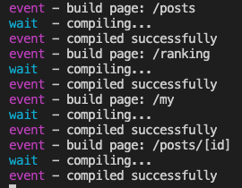

위 사진처럼 Next.js의 dev 모드에선, 특정한 경로에 대한 request가 들어오면 dev server가 해당 페이지를 build해서 제공한다.

일정 시간이 지난 후부터 dev server가 browser의 request에 반응하지 않는 문제가 있었다.

이 버그가 발생하면 dev server를 종료하고 재시작해야해서 매우 불편했다.

프로젝트 폴더를 삭제해보고 컴퓨터를 바꿔봐도 해결되지 않았는데, 결론은 브라우저 문제였다.

### 솔루션

캐시된 service worker가 쌓여서 발생하는 것이라고 한다.

크롬 개발자 도구 -> Application -> Clear Storage 로 접근해서 ~~Clear site data~~를 해주면 정상적으로 작동한다.

[크롬 ServiceWorker 도구](chrome://serviceworker-internals/) 페이지에 접속해서 모두 Unregister하는 방법으로도 해결 가능하다.

위 페이지에 접속해서 아래 명령어를 입력하는 것으로 쉽게 모두 Unregister할 수 있다.

```tsx
document.querySelectorAll('button.unregister').forEach((item) => {
  item.click();
});
```

### Ref

- [Next.js dev server gets stuck after a while, requests just spin](https://github.com/vercel/next.js/issues/10061)
