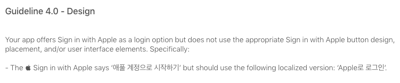
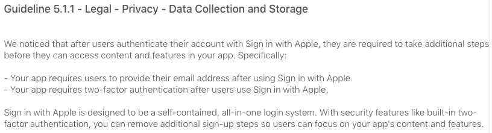
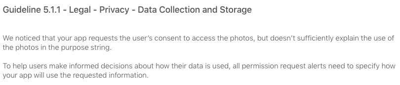
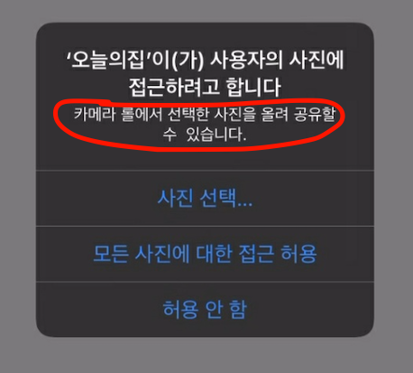

최근 개발중인 PICKK 앱이 조만간 플레이스토어/앱스토어 출시를 앞두고 있습니다.

iOS 심사가 까다롭기로 소문나서 걱정했는데, 리젝 사유가 명확하고 피드백이 빨라 무난했습니다 :)

PICKK iOS 앱스토어 리젝 사유와 해결한 방법에 대해서 간단하게 정리해보겠습니다.

### 1. Apple로 로그인 (텍스트)



<br>

애플 로그인 버튼의 텍스트를 `애플 계정으로 시작하기`로 했었는데, `Apple로 로그인`으로 바꿔야만한다고 합니다. 😅

이외에도 애플 로그인 버튼의 디자인은 애플에서 제시한 여러 규칙들을 지켜야합니다. 자세한 내용은 [Human Interface Guidelines](https://developer.apple.com/design/human-interface-guidelines/sign-in-with-apple/overview/buttons/) 참고

<br>

### 2. Apple로 로그인 (데이터)



<br>

애플 로그인을 통해 인증된 유저에게 이메일/전화번호 등의 추가 정보를 수집하지 말라고 합니다.

유저들에 대한 확실한 연락 수단을 위해 수집하고 있었는데, 애플 연동 유저에게만 수집하지 않도록 바꿔야만 했습니다.. 😥

<br>

### 3. 권한 요청 메세지





<br>

사진 접근 권한 요청시 안내 문구를 명시하라는 내용입니다. 위와 같이 사용됩니다.

```xml
	<key>NSPhotoLibraryUsageDescription</key>
	<string>카메라 롤에서 선택한 사진을 올려 공유할 수 있습니다.</string>
```

Info.plist에 위 내용을 추가해서 해결할 수 있었습니다.
