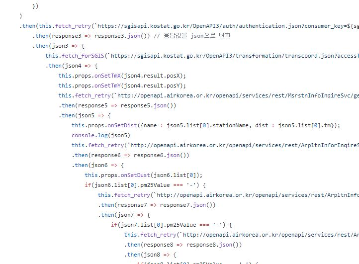

3월부터 시작한 CEOS 활동이 드디어 마무리 되었습니다. 🎉

길다면 길고 짧다면 짧은 시간이었지만, 정말 많은 일이 있었습니다.

`javascript`도, `react-native`도 처음 접해봤는데 좋은 팀원들과 함께하니 잘 배울 수 있었던 것 같아요!

## CEOS?

CEOS는 신촌연합IT창업동아리로, 서강/연세/이화/홍익대학교 학생들이 각각 기획/디자인/개발 파트로 참가해 팀단위로 창업 활동을 경험합니다. [홈페이지](https://www.ceos.or.kr/)

신촌 지역 기반이라 접근성이 좋고, 창업에 대해 제대로 배울 수 있어 신촌 대학생이라면 정말 적극 추천합니다!

### 동아리 활동

1차 서류접수 → 2차 면접을 통해 선발합니다.

4~6명이 한 팀을 이뤄 프로젝트를 진행하며 기획/디자인/개발 포지션별로 1~2명이 참여합니다.

시장조사, 사업성 검증, MVP, 사업계획서 작성, KPI/Funnel등의 세션을 통해 창업 전반에 대한 인사이트를 얻을 수 있습니다.

아이디어톤, 해커톤에서 다 같이 모여서 팀단위로 프로덕트를 개발하기도 합니다!

마지막 데모데이에는 팀별 발표 및 시상이 있습니다.

### 프로젝트 시작

지난 3월 28일에 이뤄진 팀 빌딩 이후 6월 28일 데모데이까지 정확히 3개월이라는 시간 동안 프로젝트를 진행했습니다.

저희 팀은 기획자 2명, 디자이너 1명, `개발자 1명`으로 이뤄졌는데요.

다른 개발자와 함께 프로젝트를 진행하며 협업, 코드리뷰를 해보고 싶은 마음도 있었지만, 동아리 인원이 부족해 경험하지 못 하게 되어 정말 아쉬웠습니다.

그래도 제일 좋아하는 사람들, 잘하는 사람들과 팀이 돼 정말 기뻤습니다!

다들 저보다 훨씬 전문적인 사람들이어서 잘 따라갈 수 있을까 걱정도 됐습니다.

### 고난

정말 훌륭한 팀원들을 만났지만, 프로젝트를 진행하는 과정은 쉽지만은 않았습니다.

프로젝트를 시작하며 가장 먼저 Data Modeling 및 DB 설계를 진행했는데, 아이템이 계속 엎어지니 계속 DB를 만들고 drop하는 과정만 반복했습니다.

하늘옷장 프로젝트를 시작하기 전까지 3개의 아이디어를 디벨롭하다가 엎었습니다. 😥

의사 결정 단계에서 좀 더 명확했더라면 훨씬 시간을 단축할 수 있었을 것 같아 아쉬움이 남습니다.

### 하늘옷장 🌤

잦은 아이템 변경으로 인해 저를 포함한 팀원 모두가 지쳐있던 와중, 하늘옷장(날씨앱)이라는 다소 뻔한 아이템을 선택하게 되었습니다. 여러 이유가 있었지만, 개발적으로는 다음의 3가지가 주 된 이유였습니다.

1. 날씨 앱은 참고할 `예제가 매우 많다`. 대부분의 기능이 이미 구현돼 github에 올라와 있기 때문에 고민할 필요 없이 빠르게 기능을 추가할 수 있다.
2. 서버 및 데이터베이스 없이 완성할 수 있다. 가능한 개발기간이 1주반밖에 안 되는데 클라이언트 이외의 것을 개발할 수 없다.
3. 규모가 작고 Device 관련 기능이 적어 `React-Native`로 개발하기에 적합합니다.
4. (1,2,3을 통해서) 빠르게 개발을 끝내고 배포할 수 있다.

### 스파게티

 

짧은 개발 기간, 부족한 javascript 지식 때문에 💩 같은 코드들을 작성할 수 밖에 없었습니다.

Demoday 평가항목에 개발적인 디테일은 별로 고려되지 않겠다는 생각에 마음 편하게 코드의 질을 버릴 수 있었습니다.

코딩 컨벤션, 객체 지향적 설계 같은 것들은 완전히 무시한 채로 보이는 것을 불리기 위해서 어마어마한 양의 스파게티 코드를 찍어냈습니다.

오른쪽의 사진은 그 과정에서 탄생한 `공포의 8중 fetch`입니다. 다시 봐도 상당히 혐오스럽네요..

### 컨텐츠

이런 선택을 통해서 제가 가져간 것은 다양한 컨텐츠였습니다.

사실상 하늘옷장에서 유저가 무언가를 할 수 있는 화면은 HomeScreen 밖에 없거든요.

그래서 보기 좋은 `interaction`들을 최대한 많이 넣어야겠다고 생각했습니다.

1. `Animation` : react-native 모듈에 기본적으로 내장되어있는 `LayoutAnimation`을 통해 정말 쉽게 Animation들을 구현할 수 있었습니다. 코드를 들여다보면 안정성은 커녕 구조적으로도 굉장히 이상하게 구현되어 있지만, Demoday에 평가자들의 시선에 '그럴싸하게' 보이는 데에는 충분했습니다.

2. `Share`: 이것 역시 react-native 모듈에 기본적으로 내장되어있는 `Share`를 통해 간단한 수준에서 구현했습니다. 기본 함수에 내용만 추가한 거라 개발 시간은 2시간도 안 걸렸지만 구현하고 나니 앱이 훨씬 짜임새 있어 보였습니다.

3. `Easter Egg` : 마지막은 시연용 `이스터에그`였습니다. 사실 사용자 맞춤 온도설정이라는 크리티컬한 기능은 미완으로 남겨두고서 이스터에그를 추가한다는 것 자체가 양심적으로 매우 찔렸지만, 데모데이에 좀 더 많은 것을 보여주기 위해선 어쩔 수 없는 선택이었습니다. (사용자 맞춤온도설정은 시연할때 별로 화려하지 않기 때문에 ㅎㅎ;)

### 결과물

1. 데모데이 1등했습니다. 🥇
2. 플레이스토어에 배포했습니다. [링크](https://play.google.com/store/apps/details?id=com.skycloset)
3. Github에 첫 레포를 만들었습니다. [링크](https://github.com/greatSumini/skycloset_cli)

### 마치며

개발이라곤 학교에서 해본 C언어 과제가 전부였던 제가 CEOS 활동을 하면서 정말 많이 달라진 것 같습니다.

또 지금까진 개발이 그닥 재밌다고 생각하지 않았는데, 직접 서비스를 기획/구현/배포 해보니 정말 재밌고 유익했습니다!
