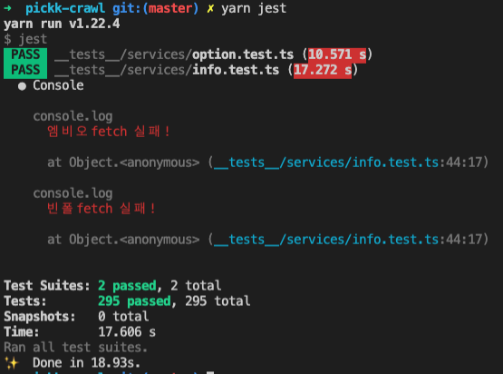

## 핔 크롤러가 뭔가요?

[핔](https://pickk.one) 서비스에서 사용되는 아이템의 이름, 가격, 옵션, 품절 여부, 추가 금액등의 정보들을 크롤링합니다.

Node.js + Typescript로 작성했고, Cheerio를 사용하며, Vercel Serverless로 배포했습니다.

- [깃헙 레포지토리](https://github.com/pickk-dev/pickk-crawl)

## 왜 갑자기 테스트를 도입했나요?

크롤링은 굉장히 불안정한 작업입니다.

잘 작동하던 완벽한 크롤러도 다음 사유로 인해 갑자기 에러가 날 수 있습니다.

1. 대상 웹페이지의 구조가 바뀜
2. 크롤링을 시도하는 순간 네트워크 상태가 불량함
3. 대상 웹서버의 보안이 강화됨
4. 대상 웹서버의 응답 속도가 느려짐 (timeout 발생)

따라서 우리는 크롤러를 작성한 이후에 계속해서 **'잘 작동하는지'** 점검해줄 필요가 있습니다.

몇백개의 웹사이트에 대해서 일일이 수동으로 상품 URL을 넣어 보고 결과를 확인하는 것은 말이 안 되죠.

자동화된 테스트로 튼튼한 CI를 구축해야 합니다.

## 첫 번째 버전 : 잘 작동하지만 성능이..?

```tsx
import InfoCrawlService from '../../services/info';
import testCases from '../test-cases.json';

describe('Test brands', () => {
  for (const testCase of testCases) {
    const { name, url, isPartner } = testCase;
    it(name, async (done) => {
      const infoCrawlService = new InfoCrawlService(url);
      const data = await infoCrawlService.crawl();
      expect(data.brandKor.length).toBeGreaterThan(0);
      expect(data.name.length).toBeGreaterThan(0);
      expect(data.imageUrl.length).toBeGreaterThan(0);
      expect(data.originalPrice).toBeGreaterThan(0);
      expect(data.salePrice).toBeGreaterThan(0);
      if (isPartner) {
        expect(data.images.length).toBeGreaterThan(0);
      }
      done();
    });
  }
});
```

<br>

가장 직관적인 초기 버전입니다.

for문으로 testCases를 순회하며 it(테스트)를 생성합니다.

정말 잘 작동하지만, 한가지 문제가 있는데요.

jest의 테스팅 환경에서 각 테스트는 ~~무조건 순차적으로 실행~~되기 때문에 ~~A크롤링-B크롤링-C크롤링-...~~ 과 같이 프로세스가 직렬적으로 이어져, 테스트 케이스가 늘어남에따라 실행시간이 선형적으로 증가합니다.

웹페이지 1개를 fetch하는 데에 평균 3초 정도 소요되니 10개면 30초, 100개면 300초...

프로세스를 병렬적으로 개선해야만 했습니다.

## 병렬 처리 : Promise.all

```tsx
import InfoCrawlService from '../../services/info';
import testCases from '../test-cases.json';

let datas;
beforeAll(async () => {
  datas = await Promise.all(
    testCases.map(
      ({ url }) =>
        new Promise(async (resolve) => {
          const infoCrawlService = new InfoCrawlService(url);
          const data = await infoCrawlService.crawl();
          resolve(data);
        })
    )
  );
});

describe('Test brands', () => {
  for (let i = 0; i < testCases.length; ++i) {
    const { name, isPartner } = testCases[i];
    it(name, (done) => {
      const data = datas[i];
      expect(data).toBeTruthy();
      expect(data.brandKor.length).toBeGreaterThan(0);
      expect(data.name.length).toBeGreaterThan(0);
      expect(data.imageUrl.length).toBeGreaterThan(0);
      expect(data.originalPrice).toBeGreaterThan(0);
      expect(data.salePrice).toBeGreaterThan(0);
      if (isPartner) {
        expect(data.images.length).toBeGreaterThan(0);
      }
      done();
    });
  }
});
```

<br>

Fetch 프로세스를 병렬화해 개선한 두번째 버전입니다.

beforeAll은 말 그대로 모든 테스트를 실행하기 전에 전역으로 1번 실행되는 함수인데요, 여기서 모든 데이터를 미리 fetch 해놓고 테스팅 과정에선 가져다 쓰기만 하고 있습니다.

무지막지하게 오래 걸리던 실행 시간이 5~15초로 단축됐습니다! 👏👏👏

하지만 또 문제가 있었습니다.

1. 느리거나 접속이 안 되는 사이트들이 프로세스를 오랫동안 붙잡고 있다가 timeout 에러를 발생시켰습니다.<br>
   Promise.all은 모든 작업을 동시에 끝내기 때문에, 다른 사이트들의 데이터들도 같이 기다려야만 했습니다.

2. 테스트케이스중 1개라도 fetch에 실패하면 Promise.all 자체가 에러로 처리됐습니다.<br>
   이것은 Promise.all의 특징인데요, 이름 그대로 ALL or NOTHING으로 처리됩니다..

위의 문제들 때문에 테스트의 실행 시간이 길어지고, 긴 시간을 기다려도 복불복으로 테스트 전체가 실패했습니다.

첫번째 버전보단 나았지만, 여전히 사용할 수 없는 수준이었죠.

## Fetch 로직 분리!

```tsx
// /__tests__/data/fetch-htmls.ts
import fs from 'fs';
import chalk from 'chalk';
import Progress from 'progress';

import { requestHtml } from '../../lib';

import testCases from './test-cases.json';

const { red, green, grey } = chalk;

const bar = new Progress('fetching htmls... [:bar] :percent :etas', {
  complete: '=',
  incomplete: ' ',
  width: 20,
  total: testCases.length,
});

const log = {
  fail: (message: any) => {
    console.log(red.inverse(' FAIL ') + message);
  },
  success: (message: any) => {
    console.log(green.inverse.bold(' SUCCESS ') + message);
  },
};

const fetchHtmls = async (fileName: string) => {
  try {
    const htmls = await Promise.all(
      testCases.map(
        ({ name, url }) =>
          new Promise(async (resolve) => {
            try {
              const html = await requestHtml(encodeURI(url));
              bar.tick();
              resolve(html);
            } catch (e) {
              log.fail(name + grey(e.message));
            }
          })
      )
    );
    process.stdout.clearLine(0);
    process.stdout.cursorTo(0);
    log.success(` fetch complete!`);
    const path = `${__dirname}/${fileName}.json`;
    fs.writeFileSync(path, JSON.stringify(htmls, undefined, 2), 'utf-8');
    log.success(` ${fileName}.json generated ✨`);
  } catch (e) {
    console.log(red.inverse(' Error occured!! '));
    console.log(red(e));
  }
};

fetchHtmls('test-htmls');
```

테스트케이스에 등록되어있는 모든 웹사이트의 HTML을 fetch해서 저장해두는 함수를 만들었습니다.

덕분에 불안정한 fetch단계만 분리해서 실행할 수 있어 테스트의 안정성이 높아졌습니다.

또 select 코드만 변경된 경우엔 매번 fetch할 필요 없이 테스트만 돌리면 돼서 성능도 좋아졌습니다!

progress, chalk 라이브러리를 이용해 인터페이스도 구현했습니다.

이 방식으로 fetch 로직의 분리는 성공했지만, 위에 존재했던 2가지 문제들중 어느 것도 해결되지 않았습니다.

## 최종 : Promise.allSettled 도입, timeout 명확히 지정!

```tsx
import fs from 'fs';
import chalk from 'chalk';
import Progress from 'progress';

import { allSettled, requestHtml } from '../../lib';

import testCases from './test-cases.json';

const { red, green, grey } = chalk;

const bar = new Progress('fetching htmls... [:bar] :percent :etas', {
  complete: '=',
  incomplete: ' ',
  width: 20,
  total: testCases.length,
});

const log = {
  fail: (message: any) => {
    console.log(red.inverse(' FAIL ') + ' ' + message);
  },
  success: (message: any) => {
    console.log(green.inverse.bold(' SUCCESS ') + ' ' + message);
  },
};

const fetchHtmls = async (fileName: string) => {
  try {
    const htmlDatas = await allSettled(
      testCases.map(
        ({ name, url }) =>
          new Promise(async (resolve) => {
            try {
              const html = await requestHtml(encodeURI(url));
              resolve({ name, html });
            } catch (e) {
              resolve({
                name,
                html: null,
                message: e.toString(),
              });
            } finally {
              bar.tick();
            }
          })
      )
    );
    const failedHtmlDatas = htmlDatas.filter(
      (htmlData) => !htmlData['value']['html']
    );
    failedHtmlDatas.forEach((htmlData) => {
      log.fail(
        `${htmlData['value']['name']}` + grey(htmlData['value']['message'])
      );
    });
    if (failedHtmlDatas.length) {
      console.log('❗실패한 브랜드는 jest 실행시 다시 fetch합니다❗');
    }

    log.success(
      `fetch complete! (${testCases.length - failedHtmlDatas.length}/${
        testCases.length
      })`
    );

    const testHtmls = {};
    htmlDatas.forEach((htmlData) => {
      if (htmlData['value']['html']) {
        testHtmls[htmlData['value']['name']] = htmlData['value']['html'];
      }
    });

    const path = `${__dirname}/${fileName}.json`;
    fs.writeFileSync(path, JSON.stringify(testHtmls, undefined, 2), 'utf-8');
    log.success(`${fileName}.json generated ✨`);
  } catch (e) {
    console.log(red.inverse(' Error occured!! '));
  }
};

fetchHtmls('test-htmls');
```

현재 프로덕션에 적용된 최종 코드입니다. 이전 버전과 유사하지만 결정적인 개선점들이 있습니다.

1. timeout 제한을 엄격하게 관리<br>
   모든 fetch request에 timeout을 명시하고, 모든 case에서 request 시간의 합이 일정하도록 조절한다.
2. allSettled 도입 <br>
   Promise.all과 다르게 일부 case가 reject되더라도 온전히 데이터를 반환합니다. Promise.allSettled는 node 버전 호환 문제를 해결하기가 귀찮아 인터넷에 공개된 코드를 복붙했습니다. [링크](https://github.com/ppeeou/makelib/blob/master/Promise/allSettled.js)
3. bar.tick() 함수를 finally문으로 분리해서 에러시에도 일단 로딩이 진행되도록 했습니다. 별거 아닌 것 같지만 답답함이 크게 개선되었습니다!
4. fetch 실패시 안내 문구들을 추가했습니다.

## 결과


<center>fetch 실행 결과</center>



<center>jest 실행 결과</center>

295개의 테스트케이스를 7초, 18초만에 처리하는 준수한 성능을 갖게 됐다 ✨
