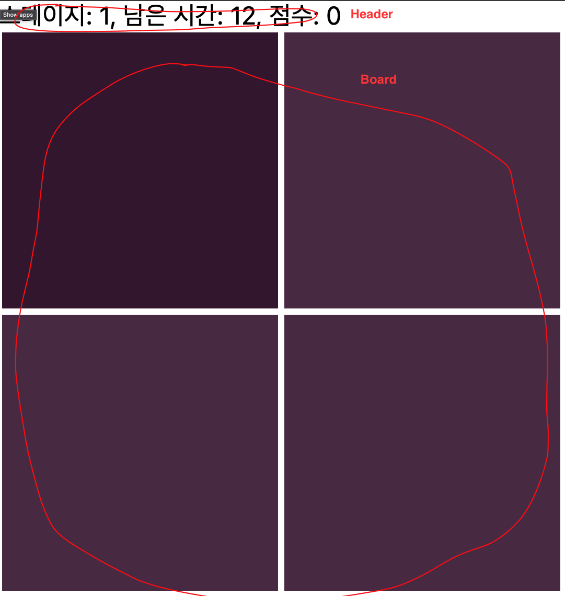

이번에 좋은 기회로 넘블에서 리액트 챌린지를 맡았습니다. [링크](https://www.numble.it/45cee9d3-49ad-4f67-9d2a-14607c2eeba7)<br/>
(넘블은 IT 기획자, 디자이너, 개발자를 위한 사이드 프로젝트 챌린지 커뮤니티입니다.)

아무도 참여하지 않으면 어쩌나 걱정했는데, 생각보다 참여도/제출률이 높아서 기쁘네요 ㅎㅎ

혹시 참여하셨다면 챌린지는 어떠셨나요? 간단해 보이지만 막상 개발해보면 신경 쓸 부분이 꽤 있는 문제입니다.

이 글에서는 이번 챌린지를 어떤 관점으로 접근해야하고, 또 출제자인 저의 의도는 무엇이었는지에 대해 설명해보려합니다.

## 1. 해설

> 이 챌린지를 통해 우리는 이 챌린지를 통해 우리는 `요구사항에 따라 적절한 단위로 component를 나눠볼 수 있고, 어느 component가 어느 state를 가지고 있어야하는가에 대해 실전적으로 익힐 수 있으며, 적절한 prop을 사용해 탄력적인 component 작성에 대해서도 연습`할 수 있어요.

위의 지문에서 알 수 있듯이 이번 챌린지의 목표는 React의 핵심 개념이라 할 수 있는 **state**를 적절히 정의하고 변경하는 것입니다.

따라서 게임기획/스타일링/최적화 등은 평가에 고려하지 않있으며, 이 글에서도 다루지 않을 예정입니다.

이 글대로 구현된 예제는 [여기](https://github.com/greatSumini/numble-thinking-in-react)에 업로드해두었습니다!

## 1-1. state 적절히 정의하기

"State is plain Javascript object hold information that influences the output of render, which is managed within the component" ( [출처 - React 공식 문서](https://reactjs.org/docs/faq-state.html#what-is-the-difference-between-state-and-props) )

위의 정의를 통해 우리는 다음 두 가지를 알 수 있습니다.

1. state의 변경은 렌더링을 유발한다.
2. 렌더링을 유발시킬 수 있는 값을 state로 정의한다.

최소한의 state를 알맞은 형태로 정의하는 것은 React의 상태 관리에서 가장 중요한 부분 중 하나입니다.

기능 단위로 변경되는 데이터들 중에 state로 만들 것을 찾아봅시다!

```tsx
1. 게임을 시작하면
   - 스테이지가 1이 된다.
   - 점수가 0이 된다.
   - "게임중" 상태가 된다.
   - 남은 시간이 15가 된다.
2. 정답을 고르면
   - 스테이지가 1 늘어난다.
   - 점수가 적절히 늘어난다.
   - 남은 시간이 15가 된다.
3. 오답을 고르면
   - 남은 시간이 3 줄어든다. 0 미만으로 줄어들지 않는다.
4. "게임중"이면 1초마다
   - 남은 시간이 1 줄어든다. 남은 시간이 0이면 게임을 종료한다.
5. 게임이 종료되면
   - "게임종료" 상태가 된다.
```

스테이지, 점수, ‘게임중'/’게임종료', 남은 시간, 정답의 index를 데이터라고 생각할 수 있겠네요.<br/>
stage, score, isPlaying, remainSecond, answerIndex라고 네이밍하겠습니다.

이제는 위에서 정의한 것들 외에 markup에 필요할만한 데이터들을 정리해보겠습니다.

```tsx
1. 이번 스테이지에서 노출되는 사각형의 개수
2. 이번 스테이지에서 정답인 사각형의 색상
3. 이번 스테이지에서 오답인 사각형의 색상
4. 이번 스테이지에서 노출되는 사각형의 너비/높이
```

위의 4가지를 tileCount, answerTileColor, wrongTileColor, tileWidth라고 네이밍하겠습니다.

<br/>

여기서 tileCount, tileWidth는 stage를 통해 계산될 수 있기 때문에 state로 정의하지 않습니다.

따라서 우리가 사용할 state는 stage, score, isPlaying, remainSecond, answerIndex라고, answerTileColor, wrongTileColor입니다.

### 1-2. state 적절히 배치하기

아래 이미지처럼 어플리케이션을 Header, Board 두 컴포넌트로 나눠보겠습니다.



각 컴포넌트가 markup rendering시와 event handling시에 사용하는 state들은 다음과 같습니다.

| 컴포넌트 | markup render                          | event handling                                     |
| -------- | -------------------------------------- | -------------------------------------------------- |
| Header   | stage, score, remain Second            | 없음                                               |
| Board    | stage, answerTileColor, wrongTileColor | stage, score, isPlaying, remainSecond, answerIndex |

<br/>

stage, score, remainSecond는 두 컴포넌트 모두에서, 나머지는 Board에서만 사용되고 있습니다.

따라서 stage, score, remainSecond는 두 컴포넌트보다 상위 레벨에서 관리되어야합니다.<br/>
나머지 state들도 같은 맥락에서 사용되므로 같은 레벨에서 관리하면 됩니다~

### 1-3. state 적절히 관리하기

아래의 예시처럼 모든 state, handler function을 부모 컴포넌틑에서 선언하는 것은 좋지 않은 선택입니다.<br/>
당장도 가독성이 좋지 않고, 추후에 변경사항이 생겼을 때 손대기 어려운 컴포넌트가 될 수 있기 때문입니다.

```tsx
export default function App() {
  const [stage, setStage] = useState(1);
  const [score, setScore] = useState(0);
  const [remainSecond, setRemainSecond] = useState(15);
  // 중략 ..

  const startGame = () => {
    setStage(1);
    setScore(0);
    setRemainSecond(15);
    // 중략 ..
  };
  // 중략 ..

  return (
    <>
      <Header stage={stage} score={score} remainSecond={remainSecond} />
      <Board {...} />
    </>
  );
}
```

<br />

Custom hook으로 stateful logic들을 캡슐화해서 개선할 수 있습니다.

```tsx
// useGame.ts
export const useGame = () => {
  const [stage, setStage] = useState(1);
  const [score, setScore] = useState(0);
  const [remainSecond, setRemainSecond] = useState(15);

  // 중략 ..

  const start = () => {
    setStage(1);
    setScore(0);
    setRemainSecond(15);
    // 중략 ..
  };
  // 중략 ..

  return {
    state: { stage, score, remainSecond, ... },
    action: { start, ... }
  }
}

// App.tsx
import { useGame } from './useGame';

export default function App() {
  const { state, action } = useGame();

  return (
    <>
      <Header {...state} />
      <Board {...} />
    </>
  );
}
```

<br />

같은 맥락에서 동시에 변경되는 여러 state를 관리할 때는 `useReducer`를 사용해보는 것도 좋습니다.

- useReducer가 익숙하지 않은 분들은 [React docs - useReducer](https://reactjs.org/docs/hooks-reference.html#usereducer)를 참고해보시면 좋습니다.

```tsx
function reducer(state, action) {
  switch (action.type) {
    case 'START':
    // 중략 ..
    case 'SELECT_CORRECT':
    // 중략 ..
    default:
      throw new Error();
  }
}
```

## 2. 피드백 - 불필요한 state 선언, effect

제출해주신 코드를 피드백하며 피해야할 패턴을 소개해보겠습니다.

```tsx
// App.js
const App = () => {
  // ...
  const [itemList, setItemList] = useState([]);

  // ...

  useEffect(() => {
    // ...
    const itemCnt = Math.pow(Math.floor((stage + 1) / 2 + 1), 2);
    // ...
    const tmpList = [];
    for (let i = 0; i < itemCnt; i++) {
      tmpList.push(i);
    }
    setItemList(tmpList);
  }, [stage, isPlaying]);
  // ...
};

// board.jsx
const Board = (props) => [
    // ...
    return (
      <BoardContainer>
        {itemList.map((item) => <BoardItem {...} />)}
      </BoardContainer>
    )
]
```

**itemList**는 각 stage의 tile들의 index를 저장하는 number 타입의 배열 state입니다.<br/>
useEffect를 사용해 stage, isPlaying state가 변경될 때마다 itemList를 같이 변경해주고 있네요!

아래와 같이 개선해보면 좋을 것 같습니다 😄

1. itemList는 stage를 통해 얻어낼 수 있기 때문에 state로 선언하지 않아도 됩니다.
2. 배열 대신 render될 item의 길이만 전달하고 `[...Array(length)].map((_, index) => ...)` 같이 사용할 수 있습니다!
3. effect를 사용하면 stage,isPlaying의 값보다 한 박자 늦게 itemList가 업데이트 됩니다. 버그가 생기기 쉬운 위험한 코드기 때문에 effect는 제거하는게 좋을 것 같아요 🥲

## 3. 마치며

간단해보이는 문제이지만, React의 핵심 개념인 state를 적절한 형태로 정의/배치/관리해볼 수 있는 문제입니다.

궁금한 점은 댓글 또는 메일 남겨주세요. 감사합니다!

추가) 참가자분들의 회고 중 좋았던 것들 공유드립니당

1. [jeonghyounsu님 - [React Numble Challenge] 다른 색깔 찾기 게임 만들기](https://velog.io/@junghyeonsu/React-Numble-Challenge-%EB%8B%A4%EB%A5%B8-%EC%83%89%EA%B9%94-%EC%B0%BE%EA%B8%B0-%EA%B2%8C%EC%9E%84-%EB%A7%8C%EB%93%A4%EA%B8%B0)
2. [sosoyim님 - 넘블 미션 회고 : 상태 관리 라이브러리 없이 상태를 관리하시오.](https://velog.io/@sosoyim/%EB%84%98%EB%B8%94-%EB%AF%B8%EC%85%98-%ED%9A%8C%EA%B3%A0-%EC%83%81%ED%83%9C%EA%B4%80%EB%A6%AC-%EB%9D%BC%EC%9D%B4%EB%B8%8C%EB%9F%AC%EB%A6%AC-%EC%97%86%EC%9D%B4-%EB%A6%AC%EC%95%A1%ED%8A%B8-%EC%82%AC%EC%9A%A9)
3. [wnsguddl789님 - NUMBLE 챌린지 [다른색깔 찾기 게임]](https://velog.io/@wnsguddl789/NUMBLE-%EC%B1%8C%EB%A6%B0%EC%A7%80-%EB%8B%A4%EB%A5%B8%EC%83%89%EA%B9%94-%EC%B0%BE%EA%B8%B0-%EA%B2%8C%EC%9E%84)
