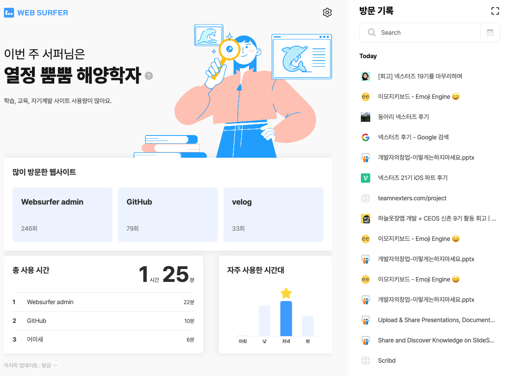

8주간의 넥스터즈 21기 활동이 얼마전에 마무리되었습니다 🎉

충분히 길다고 생각했었는데, 순식간에 지나가버려서 당황스럽네요 ㅎ.ㅠ

많은 기대를 했고, 기대한 것보다 훨씬 많이 얻어갈 수 있는 좋은 시간이었습니다 😄

## 👀 넥스터즈?

넥스터즈는 IT프로젝트 동아리로, 수도권 지역을 중심으로 대학생/직장인들이 모여 팀을 꾸리고 프로젝트를 진행할 수 있습니다.

정말 다양한 베경의 사람들을 만날 수 있어요. 시간 여유가 있다면 적극 추천합니다!

서비스를 기획하고 출시하기에 8주라는 기간이 꽤나 빠듯해서, 시간을 충분히 낼 수 없다면 활동하기 어렵습니다 🥲

## 🙏 지원 그리고 합격

선발 과정은 서류 - 면접 순으로 진행됩니다.

사실 저는 이번이 첫 지원은 아니었습니다. 한 두번 정도 지원했던 것 같아요. 모두 서류 탈락했구요 😭

탈락/합격 경험을 종합해서 생각해보면, 일단 서류는 꽉꽉 채워서 써야하는 것 같아요!

첫 지원할때는 모든 문항들을 간단명료하게 한 문장으로 설명했었는데.. 결과는 눈물의 서류컷이었습니다.

면접은 생각보다 무난했습니다. 웹 프론트엔드로 지원했는데, 기술적으로는 Next.js를 사용하는 이유 정도를 가볍게 물어보셨습니다. (제가 대학생 신분으로 지원해서 그런 것 같아요 😊)

프로젝트 진행중 팀원과 마찰이 생기면 어떻게 할 것이냐는 질문도 받았는데, 창업을 하며 느꼈던 바를 바탕으로 답변드렸습니다.

다른 질문들도 많았는데 잘 기억이 안 나네요.. 엄청 뚝딱거려서 떨어진줄 알았는데 붙어서 너무 다행이었어요 ㅎㅎ

## 😱 예상치 못한 고난 - 내가 PM?!

넥스터즈 활동 과정은 크게 아이디어 선정 / 팀빌딩 / 팀활동 으로 나눠볼 수 있습니다.

각자 아이디어를 제시하고, 상위 N개를 투표로 뽑은 후에 발제자들이 PM이 되어 팀을 꾸리는 방식입니다.

아무것도 모르던 저는 그냥 좋아보이는 아이디어를 올렸는데, 선정이 돼버려서 갑자기 팀장이 되고 말았습니다 ㅎ..

빵빵한 경력자분들 사이에서 PM을 맡는 것도, 으쌰으쌰하면서 분위기를 이끄는 것도 쉽지 않게 느껴져 처음에는 정말 막막했습니다 😱

다행히도 너무 좋은 팀원분들을 만나서 부담 없이 재밌게 활동할 수 있었어요.

또 덕분에 발표할 기회도 많이 얻게 되어서 결론적으로는 너무 좋았습니다 ㅎㅎ

## 🏄 서비스 소개

 

- 한줄 소개: 웹 방문 기록을 수집하고 통계를 제공해주는 서비스

- 모토: 스마트폰의 스크린타임처럼, 사용자에게 웹사용에 대한 유용한 데이터들을 제공

프론트엔드는 React + Redux를, 백엔드는 Nestjs + TypeORM을 사용해 만들었습니다.

현재는 방문기록리스트/대시보드 기능만 있는데, 추후에 북마크 같은 기능도 추가할 생각이에요!

## 🏃 너무 알찼던 활동

저희 팀은 디자인/프론트엔드/백엔드 각 2명씩 총 6명으로 구성되었는데요, 거의 저보다 경력이 많으시고 프로젝트에 대한 열정이 있으셔서 많이 배우며 알차게 활동할 수 있었습니다 ㅎㅎ

새벽까지도 열심히 작업해주시는 열정 덕분에 성공적으로 프로젝트 진행할 수 있었습니다.

운 좋게 내부 컨퍼런스에서 발표할 기회도 얻었습니다. 창업 활동을 하며 느낀 개발자에게 필요한 마인드?를 소개해봤어요! [자료 링크](https://www.slideshare.net/ssusere90f3a/pptx-252697062) 

발표 기회 주신 운영진 분들에게 정말 감사합니다 🥰

## 🎁 결과물

1. 최종 2등했습니다 🥈
2. 크롬웹스토어 배포했습니다! [링크](https://chrome.google.com/webstore/detail/web-surfer/mkaefnhphgcdcfijioijiobgbadmabef?hl=ko)

## 🙇 마치며

정말 좋은 팀원/운영진분들 만나서 즐겁게 활동할 수 있었습니다.

좋은 인연과 프로젝트 경험 모두 얻어갈 수 있는 넥스터즈, 모두에게 추천합니다!
