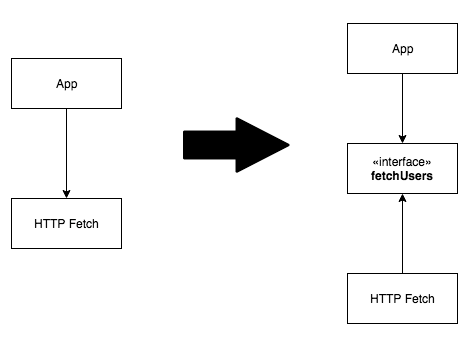

개발자라면 누구나 고도화된, 좋은 코드를 작성하고 싶어할 것입니다.

하지만 모든 코드에 대해 미래에 추가될 변경 사항, 다른 모듈들과의 관계, 가독성등을 종합적으로 고려하는 것은 매우 까다로운 일입니다.

또, 생산성과 확장성이 trade-off되는 상황에서 어느 것이 더 좋은 코드인가를 결정하는 것도 쉽지 않습니다.

이런 이유들 때문에 많은 프로젝트들이 **규모가 커질수록** 처음에 설계했던 구조에서 어긋나곤합니다.

<br>

객체지향 설계원칙 ~~SOLID~~를 적용하면 위의 문제 상황들을 상당히 해소할 수 있습니다. 모든 경우에 통용되는 원칙을 갖는 것은 ~~빠른 의사결정~~과 코드의 ~~통일성~~에 큰 도움이 됩니다.

오늘은 SOLID 원칙에 대해서 알아 보고, React에 적용해보겠습니다.

(편의를 위해 예시 컴포넌트 코드 일부가 생략되었습니다.)

## SOLID 원칙이 무엇인가요?

객체지향 프로그래밍 및 설계의 다섯 가지 기본 원칙들의 앞글자를 딴 이름입니다.(SRP, OCP, LSP, ISP, DIP)

프로그램의 ~~유지보수성~~과 ~~확장성~~을 위해서 이 원칙들을 적용할 수 있습니다.

## 단일 책임 원칙 (Single Responsibility Principle)

> There should never be more than one reason for a class to change <br> \>\> Module should have only one reason to change<br>한 모듈은 수정하기 위한 이유(책임)를 최대 1가지만 가져야한다.

모듈이 변경되어야할 여러 가지 이유가 있다면, 너무 많은 책임을 부여하고 있음을 의미합니다.

SRP 원칙을 적용해 모듈을 여러 가지로 분할하면 각종 ~~변화에 유연~~하게 대처할 수 있으며, 행동 및 책임이 격리되어있어 연쇄적인 사이드이펙트가 발생할 여지가 줄어듭니다. 이는 모두 ~~유지보수 비용의 감소~~로 이어집니다.

아래 예시 컴포넌트를 통해 확인해보겠습니다.

<br>

```tsx
function App {
   const [users, setUsers] = useState([{name: 'Jim', surname: 'Smith', age: 33}]);

   useEffect(() => {
      fetchUsers();
   }, []);

   const fetchUsers = async () => {
      const response = await fetch('http://totallyhardcodedurl.com/users');
      const data = await response.json();
      setUsers(data);
   }

   const postUsers = () =>  {
      fetch('http://totallyhardcodedurl.com/users', {
         method: "POST",
         body: JSON.stringify(users),
      })
    }

   return (
      <Wrapper>
         <Header>
         </Header>
         <Table>
            <Thead>
               <Tr>
                  <Th>First name</Th>
                  <Th>Last name</Th>
                  <Th>Age</Th>
               </Tr>
            </Thead>
            <Tbody>
               {users.map((user, index) => (
                  <Tr key={index}>
                     <Td>
                        <Input value={user.name} onChange={/* update name in the state */}/>
                     </Td>
                     <Td>
                        <Input value={user.surname} onChange={/* update surname in the state*/}/>
                     </Td>
                     <Td>
                        <Input value={user.age} onChange={/* update age in the state */}/>
                     </Td>
                  </Tr>
               ))}
            </Tbody>
         </Table>
         <Button onClick={postUsers}>Save</Button>
      </Wrapper>
   );
}
```

<br>

위 컴포넌트는 단일 책임 원칙을 위배하고있습니다. 코드를 수정해야할 이유가 1개 이상이기 때문입니다.<br>
이유들은 다음과 같습니다.

> 1. Header 컴포넌트를 변경하고 싶을 때
> 2. 새로운 컴포넌트를 추가하고 싶을 때 (ex: Footer)
> 3. User fetching 로직을 변경하고 싶을 때 (ex: endpoint url 변경)
> 4. User list table을 변경하고 싶을 때 (ex: 스타일링, ...)

위 문제는 해당 책임들을 다른 모듈로 분리시키는 방법으로 해결할 수 있습니다.

> 1. Header 컴포넌트를 별도 모듈로 분리한 뒤 import한다.
> 2. 다른 컴포넌트들도 모두 분리해, 새로운 컴포넌트가 추가됐을 때 App에서 import해서 사용만 한다.
> 3. 전역 scope에 constant로 선언하거나, 환경변수로 관리한다.
> 4. User list table 컴포넌트를 별도 모듈로 분리한 뒤 import한다.

## 개방 폐쇄 원칙 (Open Close Principle)

> Software Entites (Class, Modules, Functions, Etc.) should be open for extension, But closed for modification<br>소프트웨어의 구성요소(컴포넌트, 클래스, 모듈, 함수)는 확장에는 열려있고, 변경에는 닫혀있어야 한다.

이것은 변경에 대한 비용을 최대한 줄이면서 확장에 대해서는 가능한 극대화 해야 된다는것으로 다른 추가 사항이 일어나더라도 기존 구성은 변경하지 않으며 확장에 대한 가능성을 열어줘야 한다는 뜻입니다.

React 컴포넌트에서는 적절한 prop의 사용으로 이를 적용할 수 있습니다.

```tsx
function PostCardList({ posts }) {
  return (
    <Wrapper>
      {posts.map((post) => (
        <PostCard key={post.id} />
      ))}
    </Wrapper>
  );
}
```

위 컴포넌트를 ItemCard, LookCard도 cover할 수 있도록 아래와 같이 리팩토링할 수 있습니다.

```tsx
function CardList({ datas, Card }) {
  return (
    <Wrapper>
      {datas.map((data) => (
        <Card key={data.id} />
      ))}
    </Wrapper>
  );
}
```

<br>

이처럼 prop을 사용해 간단하게 컴포넌트의 확장성을 높일 수 있습니다.

## 리스코브 치환 원칙 (Liskov Substitution Principle)

> objects in a program should be replaceable with instances of their subtypes without altering the correctness of that program.<br>서브 타입은 언제나 기반 타입으로 교체할 수 있어야 한다.

이 원칙은 자식 Class가 부모 Class의 모든 메소드를 똑같이 사용할 수 있어야한다는 것입니다.

React 개발을 하며 실질적으로 적용할 일은 없다고 보시면 됩니다.

## 인터페이스 분리 원칙 (Interface Segregation Principle)

> Client should not be forced to depend upon interfaces that they do not use.<br>\>\>we should not depend on things we don't need<br>한 클래스는 자신이 사용하지 않는 인터페이스는 구현하지 말아야 한다.

사용하지 않는 데이터를 주고 받지 않아야합니다.

Typescript를 적용해 이 원칙을 쉽게 적용할 수 있습니다.

아래는 이 원칙이 지켜지지 않은 예시입니다.

```tsx
function UserTable() {
   ...

  const user = { id: 1, name: 'Thomas', surname: 'Foobar', age: 33 };

  return (
     <Wrapper>
         ...
         <UserRow user={user} />
         ...
     </Wrapper>
  );
}

function UserRow({id, name}) {
   return (
      <Tr>
         <Td>{id}</Td>
         <Td>{name}</Td>
      </Tr>
   );
}
```

<br>

UserRow 컴포넌트가 사용하지 않는 surname 값까지 같이 받고 있습니다. 아래와 같이 개선할 수 있습니다.

```tsx
<UserRow id={user.id} name={user.name} />
```

## 의존성 역전 원칙 (Dependency Inversion Principle)

> we should depend upon abstractions, not concretions.<br>추상화는 세부 사항에 의존해서는 안됩니다. 세부 사항은 추상화에 따라 달라집니다.

이 원칙은 각 모듈은 다른 모듈의 세부사항이 아닌 추상화에 의존해야한다는 것입니다.

아래 예시를 통해 설명하겠습니다.

```tsx
function App {
   ...
   useEffect(() => {
      fetchUsers();
   }, []);

   const fetchUsers = async () => {
      const response = await fetch('http://totallyhardcodedurl.com/users');
      const data = await response.json();
      setUsers(data);
   }
```

예시에서 App 컴포넌트는 fetch 모듈을 그대로 사용하고 있습니다. 엔드포인트 주소와 response를 json으로 변환하는 작업은 App 컴포넌트가 담기에 너무 구체적입니다.

이를 해결하기 위해 fetch 모듈을 추상화하는 단계를 추가할 수 있습니다. 아래는 UML 다이어그램입니다.

<br>



<br>

```tsx
function App {
   ...
   useEffect(() => {
      fetchUsers();
   }, []);

   const fetchUsers = async () => {
      const data = await UserService.list();
      setUsers(data);
   }
```

<br>

UserService를 추가해 개선한 버전입니다.

### Refs

- [위키백과 - SOLID(객체 지향 설계)](<https://ko.wikipedia.org/wiki/SOLID_(%EA%B0%9D%EC%B2%B4_%EC%A7%80%ED%96%A5_%EC%84%A4%EA%B3%84)>)
- [velog - 객체지향 개발 5대 원칙 (SOLID)](https://velog.io/@lsb156/%EA%B0%9D%EC%B2%B4%EC%A7%80%ED%96%A5-%EA%B0%9C%EB%B0%9C-5%EB%8C%80-%EC%9B%90%EC%B9%99-SOLID)
- [How to apply SOLID principles in React applications](https://blog.usejournal.com/how-to-apply-solid-principles-in-react-applications-6c964091a982)
