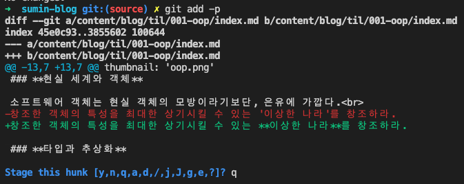

## 소개

git에 대한 개념과 기본 명령어들은 물론 숙지해야겠지만, 실제로 활용할 때는 GUI가 제공되는 툴을 사용하는 것이 더 좋다고 생각합니다.

GUI가 CLI 보다 훨씬 빠르고, 직관적이고, 실수할 여지가 적기 때문입니다.

저도 ~~git commit --amend~~, ~~git checkout -b (branch-name)~~, ~~git remote update && git checkout -t origin/(branch-name)~~ 외엔 모두 vscode built-in Source-control 툴을 사용합니다.

그런데 얼마전부터 Pycharm을 사용하게 됐는데, 제가 정말 애용하던 **Stage Selected Ranges** 기능이 없더라구요. 😨

Stage Selected Ranges 기능은 Modified 상태인 파일의 **특정 line만 stage**할 수 있는 기능인데요, 구현한 feature 단위로 나눠서 커밋하고 싶을 때 굉장히 유용합니다.

git add -p를 통해 CLI로도 해당 기능을 사용할 수 있습니다.

## git add -p



<br>

git add -p를 사용하면 파일들의 변경점을 **hunk** 단위로 보여주고, 해당 hunk에 대해 Stage, Skip 등의 action을 취할 수 있습니다. (hunk는 Stage될 수 있는 파일 조각 단위입니다.)

사용할 수 있는 명령어는 다음과 같습니다.

```shell
y - stage this hunk
n - do not stage this hunk
q - quit; do not stage this hunk or any of the remaining ones
a - stage this hunk and all later hunks in the file
d - do not stage this hunk or any of the later hunks in the file
g - select a hunk to go to
/ - search for a hunk matching the given regex
j - leave this hunk undecided, see next undecided hunk
J - leave this hunk undecided, see next hunk
k - leave this hunk undecided, see previous undecided hunk
K - leave this hunk undecided, see previous hunk
s - split the current hunk into smaller hunks
e - manually edit the current hunk
? - print help
```

<br>

자주 사용되는 명령어는 y, n, q, s, e입니다.

- y : 이 hunk를 stage 시킵니다.
- n : 이 hunk를 stage하지 않습니다.
- q : add 과정을 종료합니다.
- s : 이 hunk를 더 작은 단위의 hunk로 나눕니다. 한 hunk에 대해서 1번만 실행할 수 있습니다.
- e : 현재 hunk 내용을 직접 편집합니다.

## 결론

좋은 IDE를 사용합시다 ^^ vscode 짱짱

### Refs

- [git-add](https://git-scm.com/docs/git-add)
