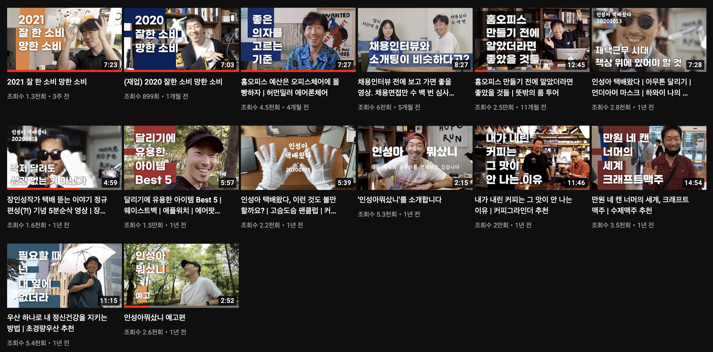

## 왜 읽었나요?

갖고 싶은건 전부 다 사야 직성이 풀리는 맥시멀리스트로서, 살만한 아이템들을 추천해주는 소위 지름도우미? 유튜브 채널들을 즐겨보는 편이다.

최근 허먼밀러 의자 구매를 고려하면서 [‘인성아뭐샀니’](https://www.youtube.com/c/earthwide)라는 채널을 알게되었다.

 

기존에 보던 채널(잇섭, 디에디트, 구매리즘, 해용, ...)과 다른 이 채널만의 차별점은 바로 제품 자체보다는 그 제품을 사용해본 자신의 경험을 ‘재밌는 이야기를 하듯이’ 소개한다는 점이다.

제품 리뷰 영상을 보면서 가장 생각 없이 재밌게 볼 수 있어 기억에 많이 남았다.

 

관심이 생겨 더 찾아보니 이 분이 현재 배민 CMO(Cheif Marketing Officer)였다. 우연히 찾게 된 재밌는 이야기를 하는 분이 업계에서도 탑티어로 인정 받고 있는 것이 신기해서 이 책을 구매하게됐다.

## 무엇을 기대했나요?

나는 마케터가 아니지만 살면서 여러 ‘설득이 필요한 순간’을 마주한다.

프로젝트에서 사용할 프레임워크를 결정하는 순간, 클라이언트와 일정/견적을 조율하는 순간, 코드리뷰를 받는/하는 매 순간순간마다 크고 작은 설득을 해야만/당해야만한다.

나이스하게, 재밌게 설득할 수 있는 스킬은 모두에게 필요하다고 생각한다.나는 INTP라서 더욱 그렇다 😅

## 어땠나요?

기대했던 커뮤니케이션은 물론, 재밌는 팀을 만드는 방법 등 유용한 지식을 많이 얻을 수 있었다.

분량은 적지만 매우 알찬 책이었다. ‘일 잘하는 법’이 궁금한 모든 사람들에게 추천하고싶다 ㅎㅎ

## 인상 깊었던 내용들

좋았던 글귀들을 간단히 정리해보았습니다 😃

### 마케터의 기본기

- ‘무엇을 했다’보다 ‘어떻게 한다’를 우선순위에 놓으면 지금 하고 있는 일이 다르게 보일 겁니다. `사소한 일이라도 사소하지 않게` 하면 위대한 경험을 만들 수 있습니다.
    
    ⇒ 프로는 디테일을 챙긴다. 작은 일도 집중해서 하기
    
- 잘 아는 소비자를 상대하는게 더 쉽고, 훨씬 더 잘할 수 있습니다. 원래 똑똑해서 노력하지 않아도 공부를 잘했던 사람은 좋은 교사가 되기 어렵습니다.
    
    ⇒ 나에게 유리한 전장을 선택하자!
    
- 경험하는데 돈을 아끼지 맙시다. 돈 쓴 만큼, 아니 그보다 더 많이 느끼고 경험을 쌓읍시다. 최선을 다해 경험합시다.
    
    ⇒ 많이 지르자 ㅎㅎ
    
- 몰입은 사람을 비이성적으로 만듭니다. 그리고 비이성적일 때 떠지는 눈이 있습니다. 가성비로만 움직이지 않는 마음이 있죠. 사람은 가성비로만 움직이지 않는다는 걸 진심으로 아는 것이 브랜딩의 시작입니다. 좋아 미치는 브랜드 몇 개를 품고 살자!

	⇒ 마음이 시키는대로, 미친놈처럼 살자! + 내가 좋아하는 브랜드는?
    
- 주어진 상황을 당연히 받아들이지 않고 `‘왜’라고 묻고` ‘혹시 이런거 아냐?’하고 가설을 만들고 이야기 해보기. ‘이러면 어때?’하고 상상속에서 바꿔보기. 이런 상상들을 쌓아두면 필요할 때 꺼내 쓸 수 있을거에요.
    
    ⇒ 일상속에서 습관화하자! 하루에 3번 ‘왜?’라고 묻기.
    

### 마케터의 기획력

- 한 사람입니다. 한 사람에게 팔 수 없다면 많은 사람에게도 팔 수 없습니다. `한 명을 깊이 감동시킬 수 있다면 이 작은 성공을 복제할 수 있습니다.` 그 한 명과 비슷한 사람이 또 있을테니까요.

- ‘물 좀 주세요’ → ‘목 말라서?’ ‘라면을 끓이고 싶어서?’ ‘샤워를 하고 싶어서?’ ‘불을 꺼야해서?’ 물을 달라는 사람이 불을 꺼야하는 상황이라면, 소화기를 주는 것이 더 좋을 수 있다. 우리는 수단(물)이 아니라 문제 해결을 원합니다.

	⇒ 일을 할 땐 가장 먼저 문제를 파악하고, 그것을 해결하는데에 집중하자!
    
- 친구들 혹은 동료에게 이야기할 만한 사건이 되려면 다음 요건들 중 하나 이상을 갖춰야 합니다. 하나만 만족해도 소문은 시작될 수 있고 둘, 셋을 만족하면 빠르게 퍼져나갈 것입니다.
    1. 신기함: 처음 들어보는 생각지 못한 일
    2. 재미있음: 웃긴, 흥미로운, 귀여운, 공감 가는 일
    3. 유용함: 쉽게 참여할 수 있는, 나와 상관 있는, 혜택이 있는 일
    4. 자기표현: 이야기를 전함으로써 자신을 표현할 수 있는 일
    
    ⇒ ‘토스증권 가입/초대 시 국내주식 1주 증정’ 이벤트는 1,3을 만족하는듯!
    
    ⇒ ‘배달의 민족 랜덤 쿠폰 이벤트’는 3을 만족하는듯!
    
- 무릎을 탁 치는 이야기에는 논리가 필요 없습니다. 긴 보고서와 발표를 통해서만 설득할 수 있다면, 내용이 아니라 논리와 장치만 화려한 걸지도 모릅니다.
    
    ⇒ 딱 듣고 Awesome!!이 나오는 일을 추진하자
    
- 어떻게 해야 디테일을 철저하게 챙길 수 있는 걸까요? 디테일의 품질을 높이려면 `‘이 정도면 됐다’ 하는 기준이 높아야 합니다.` 이것저것 본 게 많으면 기준이 올라갈 수 있어요.
    
    ⇒ 자기계발에서 browsing에 쓰는 시간을 아끼지 말자!!
    

### 마케터의 실행력

- 현재의 실행을 바꾸면 과거를 바꿀 수 있습니다. 그래서 실행에는 늘 변화가 따릅니다. `‘지금 상황에서는 이게 가장 좋으니 일단 이렇게 가보죠’` 정도로 결정을 가볍게 대하면 좋겠습니다. ‘어제는 이랬지만 오늘은 저렇습니다’라고 쉽게 말할 수 있어야 합니다.
    
    ⇒ 과거에 얽메이지 않고 항상 본질만 생각하는 자세가 필요하다!!
    
- 피드백을 잘 받아들이는 방법
    1. 상대방이 왜 그런 피드백을 했는지 문장 뒤의 의미를 생각해봅니다. 이해가 잘 안 된다면 이유를 물어서 설명을 들어봅니다. 상대방의 마음을 이해하려고 해봅니다.
    2. 피드백을 수용해서 다시 자기 생각을 만들어내야 합니다. 더 오래 고민하고 더 가까이에서 보아온 사람이 만들 수 있는 대안을.
    
- ‘너는 어떻게 생각해?’라는 물음에 답할 수 있어야 합니다.
    
- 누군가를 설득할 때에는, 내 생각이 확고하지 않은 편이 더 좋습니다. 때로 내가 설득당해도 됩니다. 내 의견을 관철하는 건 중요하지 않아요. `우리의 해결책이 나아지는 것이 더 중요합니다.`

- 우리는 좋아하는 사람이 잘되기를 바랍니다. 호감 가는 사람의 말을 더 귀 기울여 듣습니다. `서로 좋아하는 것으로 많은 문제를 해결할 수 있습니다.` 프로세스나 R&R이 놓칠 수 있는 빈틈을 메워줍니다. ‘믿음’과 ‘관심’을 주면 매력 있는 동료가 될 수 있습니다. 사람은 나를 믿어주는 사람을 믿어요. 믿을 만하지 않아도 믿습니다. 그리고 좋아합니다. 나를 좋아하는 사람은 어쩐지 나도 좋아하게 되잖아요.
    
    ⇒ 같은 팀을 좋아하고/이해하고/믿어주고/관심을 가지는 것도 좋은 동료로서 할 수 있는 노력이다!
    
- 대행사, 을 혹은 B가 알면 좋을 것
    1. Client를 뒤에서도 욕하지 마세요. 스스로 일의 태도에 영항을 미칩니다.
    2. 요청사항 뒤에 있는 진짜 이유를 확인해야합니다.
    3. `신뢰를 잃으면 다 잃는 것입니다.`

### 마케터의 리더십

- 마케터들이 제게 막 말해요. 어떤 말을 할까 말까 별로 망설이지 않는 것 같아요. 저는 마케터들에게 쉬워 보이고 싶고, 그래서 일부러 더 허술한 척합니다. 그래서 제 말에 틀린 게 있을 때 쉽게 ‘그거 아닌데요’라고 할 수 있도록이요. 팀원에게 지는 리더는 지시 대신 설명을, 명령 대신 부탁을 합니다. 팀원에게 지는 리더는 이야기를 많이 듣습니다. 충분히 듣고 판단합니다. 리더가 지면 팀이 이깁니다.

	⇒ 능동적인 업무 태도는 그냥 나오는 것이 아니다. 마음껏 주장을 펼칠 수 있는 가벼운 분위기를 만들어 주는 것도 좋은 리더의 역할
    
- “내용 간단해. `사람은 원래 안 변해. 못하는 걸 보완해주려 하지 말고, 그냥 잘하는 걸 시켜라~~` 그게 책 내용 다야. 일지 마”
    
    ⇒ ㅇㄱㄹㅇ; 누가 일을 잘 못 하고 있다면, 리더가 부적절한 업무를 할당한 것이 아닌지 의심해볼 필요가 있음!
    
- 부지런은 좋지만 바쁨은 나쁩니다. 사소한 이야기라도 할까 말까 망설이지 않도록 `조직장은 한가하고, 문턱이 없고, 허술하고, 쉬워 보이는 게 좋다고 생각합니다.` 지금의 내가 그때의 나에게 조언한다면 메일에 빠져 허우적대지 말라고 하고 싶습니다. 허우적대는 것처럼 보이지 않으면 여러분은 더 많은 이야기를 들을 수 있고, 더 많은 기회를 만나게 될 겁니다.
    
    ⇒ 누구에게나 시간 잘 내기. 여유있게 사람 대하기!!
    
- 저는 역시 게으른 조직장이 되려고 합니다. ‘게으르다’는 것은 팀원들이 스스로 하도록 만들어준다는 뜻입니다.
    
    ⇒ 기술조직에서도 이러는 게 맞는지는 잘 모르겠습니다 ㅎㅎ ㅠ 잘못된 결정들이 쌓이지 않도록 잘 관리하면서 자율성도 높이는 것이 현실적으로 어렵다고 생각합니다.
    
- `팀원들이 재미있는 일을 하도록` 만들자
    - 먼저 그 일을 `하고싶게` 만들자
    - 그 일에 대해 스스로 `결정할 수 있게` 만들자
    - 스스로 커뮤니케이션하고 `이끌 수 있는` 주인공으로 만들자

- 피드백을 할 때는
    - 사람이 아닌 일에 대해 얘기하자
    - “나는 이렇게 생각해”라는 태도로 말하자
    - `목표가 무엇인지, 그것을 잘 달성하고 있는지` 질문하자
    - (결과가 아쉽다면) 앞으로 어떻게 할지, 어떻게 해야 같은 잘못을 반복하지 않을지 질문하자