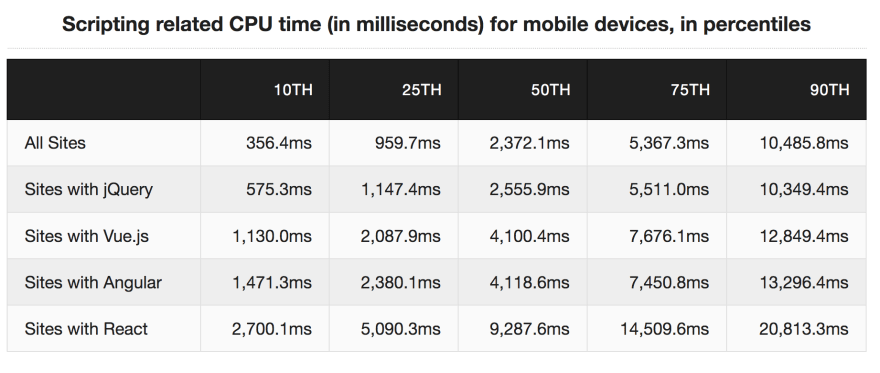
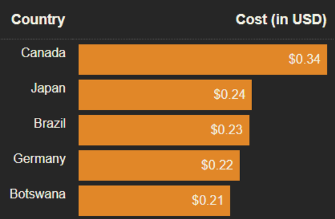

> ender minyard의 [Stop Using React](https://dev.to/ender_minyard/why-you-should-stop-using-react-g7c)를 번역한 글입니다. 원문의 의미를 손상시키지 않는 한에서 가독성을 위해 일부 의역하였습니다. 
> 한국의 상황에 맞게 일부 내용을 추가했습니다.

예전에도 리액트에 대한 의문점이 있었지만, 그땐 내가 리액트를 잘 이해하지 못 했기 때문일거라고 생각했다.

하지만 이제는 리액트를 몰랐던 시절로 돌아가, 평생 리액트를 모르는채로 살고 싶다!

이유는 다음과 같다.

### 1. 너무 느리다.

자료 제공 : tim kadlec

모바일 유저 중 53%가 로딩이 3초 이상 걸리는 웹 사이트를 사용하지 않는다.

페이지의 로딩 시간이 1초 늘어날 때마다, 10%의 유저가 이탈한다.

`성능도 유저 경험의 일부`다.

추가자료 : [React + Performance = ?](https://aerotwist.com/blog/react-plus-performance-equals-what/)

### 2. 너무 비싸다.

당신의 웹사이트는 데이터 제한 때문에 무거운 웹사이트를 자유롭게 사용할 수 없는 사람들을 고려하고 있는가?

[많은 사람들](https://macwright.com/2020/05/10/spa-fatigue.html)이 자바스크립트 프레임워크들의 과도한 용량에 대해 걱정하고 있지만, 개발자들은 그닥 신경쓰지 않는듯하다.

웹사이트의 용량을 체크해주는 테스팅 사이트를 사용해보라. [링크](https://whatdoesmysitecost.com/test/200927_AH_c905512b46e8c471bb31434d292cea52)

만약 당신의 웹사이트가 데이터 요금이 비싼 국가의 사용자들을 대상으로 하고 있다면, 용량 최적화에 대해 좀 더 고민해봐야할 것이다.

### 3. 접근성이 떨어진다.

48억명의 사람들이 여진히 2G 피쳐폰을 사용하고 있다. [출처](https://www.bankmycell.com/blog/how-many-phones-are-in-the-world)

리액트앱의 자바스크립트는 피쳐폰에서 구동하기엔 너무 무겁다.

피쳐폰 환경에서의 개발을 위한 많은 [문서](https://dev.to/addyosmani/loading-web-pages-fast-on-a-20-feature-phone-8h6), [도구](https://developer.mozilla.org/en-US/docs/Web/API/Web_Workers_API/Using_web_workers), [프레임워크](https://preactjs.com/)들이 있지만, 개발자들은 외면하기 바쁘다. 피쳐폰을 위한 최고의 개발도구인 web workers는 Javascript 서브레딧에서 [비난의 대상](https://www.reddit.com/r/javascript/comments/cv56c9/should_you_should_be_using_web_workers_hint/)이다!

만약 당신의 웹사이트가 피쳐폰에서 빠르게 작동한다면, 아이폰에서는 미친듯이 빠르게 작동할 것이다. 모든 유저들을 고려하며 개발하면, `모든 유저들`의 UX를 개선할 수 있다.

### 4. 웹의 핵심 가치를 부정한다.

리액트의 작동 원리는 다음과 같다.

> 사이트에 필요한 모든 자바스크립트를 처음 7초동안 아무것도 보여주지 않으면서 다운로드한다. 
> 하지만 한번 다운로드한 이후엔, 다시 리소스를 다운로드하지 않아도 된다. 왜냐면 리액트는 Single Page Application이기 때문이다.

이는 웹의 핵심가치와 정확히 반대된다.

> 웹은 기본적으로 모든 것을 스트리밍한다.
> 페이지들은 HTML을 제공하고, 이미지/동영상과 마찬가지로 다운로드 되자마자 볼 수 있다. 가벼운 response들만으로 브라우징을 할 수 있는 것이다.
> \- [Jake Archibald](https://invidious.snopyta.org/watch?v=G9PpImUEeUA)

인터넷은 stream이지만, 리액트는 그렇지 않다.

웹앱은 유저가 컨텐츠를 보기 위해 30초동안 다운로드해야하는 네이티브앱과는 다르다.

웹페이지를 네이티브앱처럼 다루는 것은 좋지 않다.

### More

- [The "Developer Experience" Bait-and-Switch](https://infrequently.org/2018/09/the-developer-experience-bait-and-switch/)
- [Second-guessing the modern web](https://macwright.com/2020/05/10/spa-fatigue.html)
- [Progressive Performance](https://invidious.snopyta.org/watch?v=4bZvq3nodf4)
